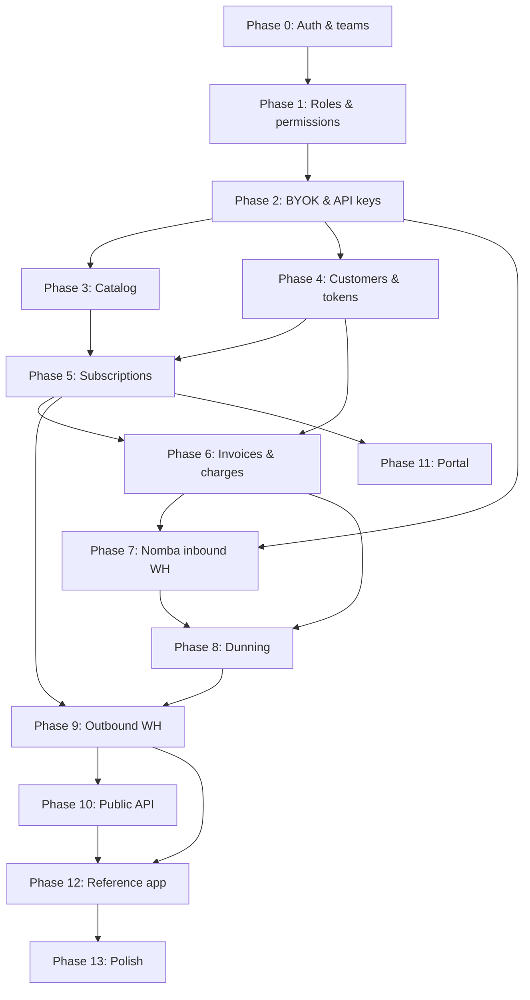

# Bouclay — Implementation Plan

Phased build plan for the hackathon subscriptions engine. Each phase has a clear outcome you can demo or test before moving on.

Authoritative schema: [`schema.md`](schema.md)

---

## Phase 0 — Foundation ✅ (done)

**Goal:** Runnable app with auth and multi-tenant teams.

**Deliverables:**

- Laravel + Inertia + Fortify
- `teams`, `team_members`, `team_invitations`, `users.current_team_id`
- Team dashboard shell, settings, invitations
- 3-step signup wizard: account details (first/last name, email, password) → business details (business name, business type, website) → business address (country, address lines, city, postal code)

**Exit criteria:** User can register through the 3-step wizard, own a personal team pre-filled with their business details, invite members, switch teams.

**Note:** Phase 0 uses a legacy single-role enum (`owner` / `admin` / `member`). Phase 1 replaces this with the RBAC model in `schema.md`.

---

## Phase 1 — Roles & permissions ✅ (done)

**Goal:** Paddle-style RBAC before billing work — permissions on roles only, many roles per team member.

**Build:**

- Migrations: `permissions`, `roles`, `role_permission`, `team_member_roles`, `team_invitation_roles`
- Migrate `team_members`: drop `role` column, add `is_owner`; team creator gets `is_owner = true` + **Admin** role
- Seeder: default roles and permissions from [RBAC seed appendix](schema.md#rbac-seed-appendix) (`Admin`, `Finance`, `Invoicing`, `Subscription KPIs`, `Support`, `Technical`)
- `HasTeams` / policies: `$user->hasTeamPermission($team, 'invoices.manage')` unions permissions across assigned roles; `is_owner` guard for `team.delete` and `members.assign_roles`
- Team member UI: checkbox role assignment (like Paddle screenshot)
- Invitation flow: assign multiple roles on invite → copy to `team_member_roles` on accept
- Share effective permissions with Inertia (`TeamPermissions` DTO expands to match seeded permissions)

**Exit criteria:** Owner assigns Finance + Invoicing to a member; member can view invoices but cannot manage API keys; non-owner cannot delete team.

---

## Phase 2 — Tenancy & integrator credentials

**Goal:** A team can connect to Bouclay as an integrator — Nomba BYOK + Bouclay API keys.

**Build:**

- `team_settings` (invoice prefix, timezone, dunning config stub)
- `team_processor_connections` — encrypted Nomba test/live keys, `inbound_webhook_token`
- Settings UI: paste Nomba keys → show copy-paste inbound webhook URL *(requires `integrations.manage`)*
- `api_keys` — Bouclay secret/publishable keys per team (test/live) *(requires `api_keys.manage`)*
- `idempotency_keys` table + middleware for write APIs

**Exit criteria:** Team saves Nomba keys; dashboard displays `POST /webhooks/nomba/{token}`; team can create/revoke a Bouclay API key.

---

## Phase 3 — Catalog (products, prices, trials)

**Goal:** Integrators define what they sell.

**Build:**

- Migrations/models: `products`, `prices`, `price_tiers` (standard + one tiered model)
- Dashboard CRUD for products and prices (recurring: monthly, annual, custom interval)
- `trial_offers` + catalog UI (free trial only for MVP — `trial_price.unit_amount = 0`, relative duration)
- All queries scoped by `team_id`

**Defer:** paid trials, product-transition trials, timestamp-duration trials, volume + graduated (ship one tiered model only).

**Exit criteria:** Team creates “Pro” product with monthly price and optional free trial offer.

---

## Phase 4 — Customers & payment methods

**Goal:** End-customers exist in Bouclay; cards tokenise via Nomba.

**Build:**

- `customers`, `addresses`, `payment_methods`
- Nomba client wrapper using **team's** keys from `team_processor_connections`
- Checkout / tokenise flow (Nomba checkout API → store `processor_token` on `payment_methods`)
- Customer CRUD in dashboard + API

**Exit criteria:** Team creates a customer, completes test checkout, payment method stored against customer.

---

## Phase 5 — Subscriptions & state machine

**Goal:** Core subscription lifecycle without full invoicing yet.

**Build:**

- `subscriptions`, `subscription_items`, `subscription_item_trials`
- Create subscription (items + optional trial offer)
- State machine: `incomplete` → `trialing` / `active`, `past_due`, `paused`, `canceled`, `incomplete_expired`
- `subscriptions.trial_ends_at`, trial end behavior fields
- Subscription API + minimal dashboard list/detail

**Exit criteria:** Customer subscribed to a plan; status visible; trial end date computed for free trial.

---

## Phase 6 — Invoicing, charges & proration

**Goal:** Money moves on a schedule; upgrades/downgrades prorate.

**Build:**

- `invoices`, `invoice_lines`, `payments`
- Period billing worker: generate invoice at `current_period_end`
- Charge via Nomba using team keys; record attempt on `payments`
- Proration on subscription item changes (invoice lines with `kind: proration`)
- Invoice numbering from `team_settings`

**Exit criteria:** Renewal generates invoice; test charge succeeds; plan change produces proration line.

---

## Phase 7 — Nomba inbound webhooks

**Goal:** Payment outcomes drive subscription state (not just synchronous API responses).

**Build:**

- Replace hardcoded webhook route with `POST /webhooks/nomba/{inbound_webhook_token}`
- Resolve team from token; verify Nomba signature
- Map events → update `payments`, `invoices`, `subscriptions` (paid, failed, etc.)
- Idempotent processing (store processor reference)

**Exit criteria:** Simulated or real Nomba webhook moves invoice to `paid` and subscription to `active`.

---

## Phase 8 — Dunning & failed-payment recovery

**Goal:** Hackathon “dunning sophistication” — retries and terminal actions.

**Build:**

- `team_settings.dunning_config` — retry schedule, max attempts
- Scheduler: `past_due` subs, retry charges with backoff
- Hard vs soft decline classification (`payments.failure_code`)
- Terminal actions: cancel, pause, or leave open (`incomplete_expired` path)
- `scheduled_changes` for cancel-at-period-end

**Exit criteria:** Failed charge triggers retries; after max attempts subscription reaches configured terminal state.

---

## Phase 9 — Outbound webhooks & events

**Goal:** Downstream developers integrate without polling.

**Build:**

- `events`, `webhook_endpoints`, `webhook_deliveries`
- Emit on lifecycle: `subscription.created`, `subscription.updated`, `invoice.paid`, `invoice.payment_failed`, etc.
- HMAC signing with endpoint secret; exponential backoff delivery worker
- Dashboard: register webhook URL + signing secret; delivery log

**Exit criteria:** Integrator URL receives signed `invoice.paid` after successful charge.

---

## Phase 10 — Billing API surface

**Goal:** API ergonomics for downstream developers.

**Build:**

- Versioned API routes (`/api/v1/...`) authenticated with Bouclay secret key + team scope
- Core resources: customers, products, prices, subscriptions, invoices
- Idempotency-Key header on POST/PATCH
- Consistent error shape; test vs live mode from key

**Exit criteria:** Full happy path runnable via HTTP client (create customer → subscribe → receive webhook).

---

## Phase 11 — Self-service portal (minimal)

**Goal:** Hackathon “customer self-service portal” — thin, not a second product.

**Build:**

- Customer-facing pages or hosted portal links (team-branded minimal UI)
- View subscription status, update payment method, cancel at period end
- Authenticated by magic link or customer portal token

**Exit criteria:** End customer can cancel subscription without support.

---

## Phase 12 — Reference integrator app (“Acme Notes”)

**Goal:** Prove the integrator story live.

**Build:**

- Tiny app (or section) that uses Bouclay API + outbound webhooks only
- One plan, subscribe button, paywall gated on webhook/`subscription.active`
- Does **not** talk to Nomba directly

**Exit criteria:** End-to-end demo: Acme connects Nomba → creates plan → user subscribes → Acme webhook fires → access granted.

---

## Phase 13 — Polish & defer bucket

**Goal:** Judge-ready demo and docs.

**Build:**

- README API examples; Postman collection optional
- Feature tests for state machine and dunning paths
- Dashboard empty states, loading, error handling

**Explicitly defer (schema present, logic later):**

- `discounts` / `discount_redemptions`
- `refunds`
- `price_currency_options`
- Metered billing (removed from schema)
- Paid / transition / timestamp trial variants

---

## Suggested timeline (hackathon)

| Order | Phase | Priority |
|---|---|---|
| 1 | Phase 1 — Roles & permissions | P0 |
| 2 | Phase 2 — Credentials | P0 |
| 3 | Phase 3 — Catalog | P0 |
| 4 | Phase 4 — Customers & PMs | P0 |
| 5 | Phase 5 — Subscriptions | P0 |
| 6 | Phase 7 — Inbound webhooks | P0 |
| 7 | Phase 6 — Invoicing & charge | P0 |
| 8 | Phase 8 — Dunning | P0 |
| 9 | Phase 9 — Outbound webhooks | P0 |
| 10 | Phase 12 — Reference app | P0 for demo |
| 11 | Phase 10 — API polish | P1 |
| 12 | Phase 11 — Portal | P1 |
| 13 | Phase 13 — Polish | P1 |

Phases 6 and 7 can overlap once charge API works synchronously; inbound webhooks should land before relying on them for dunning.

---

## Dependency graph

---

## Definition of done (hackathon demo)

1. Integrator team connects Nomba keys and pastes inbound webhook URL.
2. Integrator creates product + monthly price (+ optional free trial).
3. End customer subscribes; card tokenised; subscription reaches `active` or `trialing`.
4. Renewal or initial charge produces invoice + Nomba charge on **integrator's** Nomba account.
5. Failed payment enters dunning; retries visible.
6. Outbound webhook delivers `invoice.paid` (or failure event) to integrator URL.
7. Reference app gates access from Bouclay webhook — no direct Nomba integration in app.
