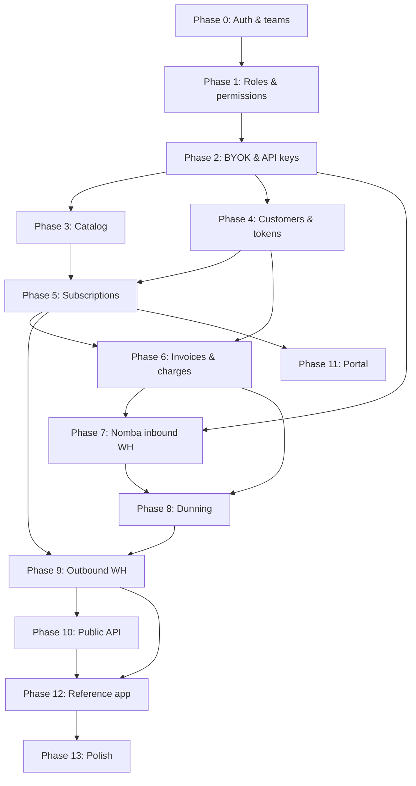

# Bouclay — Implementation Plan

> **Superseded (2026-07-10):** this document records the hackathon build (Phases 0–13) on the *pre-rework* schema and is kept as history. Active work follows [`IMPLEMENTATION_V2.md`](IMPLEMENTATION_V2.md), which takes the codebase to the reworked catalog in `schema.md` and to production-ready operation.

Phased build plan for the hackathon subscriptions engine. Each phase has a clear outcome you can demo or test before moving on.

Authoritative schema: [`schema.md`](schema.md)

---

## Phase 0 — Foundation ✅ (done)

**Goal:** Runnable app with auth and multi-tenant teams.

**Deliverables:**

- Laravel + Inertia + Fortify
- `teams`, `team_members`, `team_invitations`, `users.current_team_id`
- Team dashboard shell, settings, invitations
- 3-step signup wizard: account details (first/last name, email, password) → business details (business name, business type, website) → business address (country, address lines, city, postal code)

**Exit criteria:** User can register through the 3-step wizard, own a personal team pre-filled with their business details, invite members, switch teams.

**Note:** Phase 0 uses a legacy single-role enum (`owner` / `admin` / `member`). Phase 1 replaces this with the RBAC model in `schema.md`.

---

## Phase 1 — Roles & permissions ✅ (done)

**Goal:** Paddle-style RBAC before billing work — permissions on roles only, many roles per team member.

**Build:**

- Migrations: `permissions`, `roles`, `role_permission`, `team_member_roles`, `team_invitation_roles`
- Migrate `team_members`: drop `role` column, add `is_owner`; team creator gets `is_owner = true` + **Admin** role
- Seeder: default roles and permissions from [RBAC seed appendix](schema.md#rbac-seed-appendix) (`Admin`, `Finance`, `Invoicing`, `Subscription KPIs`, `Support`, `Technical`)
- `HasTeams` / policies: `$user->hasTeamPermission($team, 'invoices.manage')` unions permissions across assigned roles; `is_owner` guard for `team.delete` and `members.assign_roles`
- Team member UI: checkbox role assignment (like Paddle screenshot)
- Invitation flow: assign multiple roles on invite → copy to `team_member_roles` on accept
- Share effective permissions with Inertia (`TeamPermissions` DTO expands to match seeded permissions)

**Exit criteria:** Owner assigns Finance + Invoicing to a member; member can view invoices but cannot manage API keys; non-owner cannot delete team.

---

## Phase 2 — Tenancy & integrator credentials ✅ (done)

**Goal:** A team can connect to Bouclay as an integrator — Nomba BYOK + Bouclay API keys.

**Build:**

- `team_settings`, `team_processor_connections`, `api_keys` tables
- **Developers** promoted to a primary sidebar item (collapsible: Nomba Integration / API Keys / Webhooks) instead of buried in account settings
- Nomba Integration page — connect/test/disconnect per mode (test, live), type-to-confirm on live, credentials verified against Nomba's real token-issue endpoint before saving *(requires `integrations.manage`; `integrations.view` to read)*
- API Keys page — create (name, publishable/secret, test/live), reveal-once with copy-confirm-before-close, revoke; live keys blocked until a live Nomba connection exists *(requires `api_keys.manage`; `api_keys.view` to read)*
- Webhooks page — shared inbound URL (`team_processor_connections.inbound_webhook_token`), per-mode signing secret (pasted in from Nomba's dashboard, masked forever after save), rotate endpoint, "Send test event" self-check *(requires `webhooks.manage`; `webhooks.view` to read)*
- Minimal public `POST /webhooks/nomba/{token}` receiver started here; Phase 7 has since replaced this with signature verification and event mapping
- Overview onboarding checklist (business details, Nomba, API key, webhook) tying the four steps together, session-dismissible, deep-linking to the same permanent pages above

**Phase 10 follow-up now done:** `idempotency_keys` table + middleware landed with the public Billing API once external write endpoints existed.

**Exit criteria:** Team saves Nomba keys; dashboard displays `POST /webhooks/nomba/{token}`; team can create/revoke a Bouclay API key. ✅

---

## Phase 3 — Catalog (products, prices, trials) ✅ (done)

**Goal:** Integrators define what they sell.

**Build:**

- Migrations/models: `products`, `prices`, `price_tiers` (standard + graduated)
- Dashboard CRUD for products and prices (recurring: monthly, annual, custom interval)
- `trial_offers` + catalog UI, built to the full model — trial price is a real, independently-visible catalog price (free or paid), transitions to a regular price on the same product or a different one (`transition_to_different_product`), and can repeat for N iterations (`duration_iterations`). See [`CATALOG_DESIGN.md`](CATALOG_DESIGN.md) §7 for the UX rationale.
- Product detail is a single scrollable page (info, pricing, trials, metadata), not tabs — every create/edit action opens a side drawer, never a navigation
- All queries scoped by `team_id`

**Defer:** timestamp-duration trials (`duration_type: timestamp` — ship `relative` only), volume pricing model (ship graduated only). **Payment links** (shareable hosted checkout URLs, per price and per free trial offer) shipped later as a Phase 11 companion — see Phase 11 below; paid trial offer links remain deferred.

**Exit criteria:** Team creates “Pro” product with monthly price and optional trial offer. ✅

---

## Phase 4 — Customers & payment methods ✅ (done)

**Goal:** End-customers exist in Bouclay; cards tokenise via Nomba.

**UX/product spec:** [`CUSTOMERS_DESIGN.md`](CUSTOMERS_DESIGN.md) (full proposal — IA, list, detail hub, payment methods, tokenization journey, copy).

**Build:**

- `customers`, `addresses`, `payment_methods`
- Nomba client wrapper using **team's** keys from `team_processor_connections`
- Checkout / tokenise flow (Nomba checkout API → store `processor_token` on `payment_methods`)
- Customer CRUD in dashboard + API

**Exit criteria:** Team creates a customer, completes test checkout, payment method stored against customer.

### Decisions locked during design (2026-07-04) — do not re-litigate

Verified against Nomba's docs (via MCP) and Paddle's live dashboard. These shape the build; the reasoning lives in `CUSTOMERS_DESIGN.md` at the cited sections.

1. **Nomba tokenization = hosted full-redirect, tokenize-on-payment.** `POST /v1/checkout/order` with `tokenizeCard:true` + a **required real `amount`** → `{ checkoutLink, orderReference }` → redirect customer to `checkout.nomba.com/pay/…` → they pay on Nomba's page → callback to `callbackUrl?orderReference=…`. There is **no embedded card field and no $0 setup intent**. (CUSTOMERS_DESIGN §10.3)
2. **No "Add payment method" action anywhere** — matches Paddle. A card is saved only as the **byproduct of the customer paying a checkout**. The customer-detail **Payment Methods section is read-only** (list / set-default / remove; no Add button; not in the Actions menu, not in the empty state). (CUSTOMERS_DESIGN §7.4, §10.2, §10.5, §10.8)
3. **No verify-charge, no live-mode policy.** The token-minting charge is always a *real* payment the customer wanted (a one-time transaction or a subscription's first charge), never an artificial ₦50. Applies in both test and live. (CUSTOMERS_DESIGN §10.8)
4. **Collection modes = `manual | automatic`** (already in schema on `subscriptions`/`invoices`) surface as Paddle's two choices: *Manually, via invoice* (send checkout link) vs. *Automatically, using a stored payment method*. (CUSTOMERS_DESIGN §10.3)
5. **Token capture:** the exact `orderReference → tokenKey` tie is only in the `payment_success` **webhook**; `GET /v1/checkout/tokenized-card-data?customerEmail=` is the synchronous fallback (email-keyed). Extend the **existing Phase-2 `POST /webhooks/nomba/{token}` receiver** minimally to stash `tokenizedCardData` per order — NOT the full Phase 7 signature-verified event mapping. (CUSTOMERS_DESIGN §10.3, §14.8)
6. **Column mapping:** `processor_token`←`tokenKey`, `brand`←`cardType`, `last4`←`order.cardLast4Digits`, `exp_*`←`tokenExpiry*` (may be `N/A` → keep nullable). **`fingerprint` is unpopulatable** (Nomba returns none) → no cross-customer card dedupe. (CUSTOMERS_DESIGN §10.3, §10.6)
7. **`default_payment_method_id` on `customers` is canonical** for "default"; treat `payment_methods.is_default` as a derived mirror. (CUSTOMERS_DESIGN §14.9)
8. **"New business"** (Paddle's B2B entity on a customer) is **dropped** — no schema table for it. Revisit only if B2B invoicing becomes a goal (schema change, not a stub). (CUSTOMERS_DESIGN §7.4)
9. **List:** Paddle-thin — Email/Name/Status/Created, one **Status** filter (default Active), search, bulk **Archive** (soft-delete). Server-side search + pagination from the start (first table likely to grow large). No spend/subscription columns until the data exists (Phases 5–6). (CUSTOMERS_DESIGN §5, §14.2)
10. **Create/Edit** = side drawer (Bouclay's catalog idiom), minimal fields — **email required, name optional** (Paddle helper: "only required to bill by invoice"). (CUSTOMERS_DESIGN §6, §8)

### Way-forward decision: pull a **thin checkout slice** forward (Plan A) — NOT the transactions data model

Because Decision #2 removed the standalone "add card", the *only* way a card reaches Phase 4 is via a checkout — so Phase 4 must ship **one** checkout trigger to meet its own exit criteria. Chosen scope:

- **Build now (thin):** a minimal **"Charge customer"** one-time checkout — create Nomba checkout order (`tokenizeCard:true`, real amount) → redirect → callback verify (`GET /v1/transactions/accounts/single?orderReference=`) → capture token (webhook per Decision #5) → **persist the `payment_methods` row only**. Gate to **test mode** for Phase 4 (matches exit criteria; test cards = fake money). This is the entry point that appears in the Actions menu as "Charge customer".
- **Do NOT build:** `payments` / `invoices` / `invoice_lines` rows, invoice numbering, proration, tax, dunning. Reason: `payments.invoice_id` is NOT NULL → recording a payment drags in the whole invoicing model = all of Phase 6. Phase 4's checkout stores the **token/payment method only**; the money movement isn't recorded as a Bouclay `payment` until Phase 6 wires it. Acceptable because Phase 4 charges are test-mode setup, not accounted revenue.

**Why forward-pull the thin slice rather than defer to Phase 5/6:** (a) it's the only card-collection path now; (b) it **de-risks the hardest integration** — Nomba hosted-redirect + webhook token correlation — *before* Phase 5 subscriptions depend on it; (c) the checkout-order + token-capture primitive is **reused verbatim** by subscriptions (Phase 5) and invoicing (Phase 6).

**Carried into later phases (so we don't forget):**

- **Phase 5 (Subscriptions):** "Create subscription" reuses the Phase-4 checkout primitive for the first charge; enable **live-mode** card collection here (first subscription payment mints the live token). Un-disable the "Create subscription" action + section CTA on the customer page.
- **Phase 6 (Invoicing):** promote "Charge customer" to record real `payments`/`invoices`; replace the customer-page **Invoices** placeholder with the real table in the same slot; add **Total spend** column to the list and spend cell to the Overview grid. Enable live-mode standalone charges.
- **Phase 7 (Inbound webhooks):** replace the Phase-4 *minimal* `tokenizedCardData` capture with full signature-verified event mapping.
- **Phase 9 (Outbound):** emit `customer.created` / `payment_method.added` events from the hooks Phase 4 already fires for the activity timeline.

---

## Phase 5 — Subscriptions & state machine ✅ (done)

**Goal:** Core subscription lifecycle without full invoicing yet.

**UX/product spec:** [`SUBSCRIPTIONS_DESIGN.md`](SUBSCRIPTIONS_DESIGN.md) (full proposal — IA, two-pane create, list, detail hub, state machine, trial-as-line-item, copy).

**Built:**

- `subscriptions`, `subscription_items`, `subscription_item_trials`, `scheduled_changes`
- Create subscription (line items + optional trial offer) via a two-pane create flow, reusing a shared `CreateSubscription` action that the Phase 10 API now wraps (`items[]` = `{price}` | `{trial_offer}`)
- Hand-rolled **state machine** (no package) in `app/States/Subscription/` — a `SubscriptionState` contract, `BaseSubscriptionState` (throws by default), seven concrete states, `IllegalStateTransition`, and `Subscription::apply()`; `SubscriptionStatus` enum resolves state classes and carries UI `label()`/`color()`/`description()`
- `subscriptions.trial_ends_at` + trial-end-behavior fields; list, detail hub, and customer-page activation

**Exit criteria:** Customer subscribed to a plan; status visible; trial end date computed for free trial. ✅

### Decisions locked during design (2026-07-05) — do not re-litigate

Verified against Stripe's create-subscription dialog (see `SUBSCRIPTIONS_DESIGN.md`).

1. **Trials are line items, not a price property.** A subscription is a list of line items; each is a plain price (**Add product**) **or** a trial offer (**Add trial**). Adding a trial creates a `subscription_item` + a snapshotted `subscription_item_trials` row. Bouclay **never** auto-applies a trial because a chosen price is some offer's `transition_price_id`. (SUBSCRIPTIONS_DESIGN §3, §7.2, §17.2a)
2. **Free vs paid trial split (schema.md §5).** Free trial (`trial_price = 0`) → no charge, `trialing`. Paid trial (`trial_price > 0`) → billed the intro price at signup and each cycle, follows `incomplete → active` (**not** `trialing`), converts to `transition_price` at `trial_ends_at`. `current_period_end` = one **intro** cycle; `trial_ends_at` = the conversion point. (SUBSCRIPTIONS_DESIGN §10.2)
3. **A product appears at most once.** A plain line + a trial for the same product double-charges, so the create builder de-dupes by product and `CreateSubscription::resolveLines` rejects duplicate `product_id`.
4. **Collection modes** = the two Stripe/Paddle choices: *Automatically charge a saved card* (`automatic`) vs *Send an invoice to pay manually* (`manual`). Already on `subscriptions.collection_mode`; no new column.
5. **Money was staged in Phase 5; Phase 6 built invoicing.** Phase 5 used `apply('activate')` simulation and `StagedSection` hubs. Phase 6 records real `invoices`/`payments`, rewires `CreateSubscription`, replaces hub placeholders, and now includes renewal billing and proration. (SUBSCRIPTIONS_DESIGN §17.6)

### Carried into later phases — status update (2026-07-07)

The Phase 5 state machine is still the lifecycle core. Most of the originally-carried callers are now wired:

- ✅ **Phase 6:** real first charge + invoice; automatic-with-no-card hosted checkout links; renewal billing worker; trial-conversion worker; proration invoice lines; real Upcoming invoices / Payments on subscription and customer hubs.
- ✅ **Phase 7:** inbound Nomba `payment_success` / `payment_failed` webhooks drive invoice/payment/subscription settlement instead of relying only on synchronous create-time assumptions.
- ✅ **Phase 8:** incomplete-expiry, dunning retry, hard/soft decline handling, manual-invoice aging, terminal actions, and scheduled change application commands exist.
- ✅ **Phase 9:** outbound events are emitted for core customer, payment method, subscription, and invoice lifecycle events.
- ⬜ **Still deferred:** `subscription.trial_will_end` outbound event, editable dunning settings UI, and any deeper tax/discount/refund logic.

**State-machine transition owners** (the machine is complete; these callers are now mostly wired):

| Transition | Fires when | Caller wired in |
|---|---|---|
| `activate` | first payment captured | **6** ✅ (real charge at create) → **7** (webhook for async paths) |
| `pause` / `resume` / `cancel` (immediate) | dashboard action | **5** ✅ |
| cancel/pause/resume at period end | `scheduled_changes` row reaches `effective_at` | **5** writes row → **6/8** worker fires |
| `convert` | trial reaches `ends_at` | **6/8** trial-conversion worker |
| `markPastDue` | renewal charge fails / invoice past due | **6** (charge) / **7** (webhook) |
| `recover` | a dunning retry succeeds | **8** |
| `expire` | `incomplete` sub exceeds grace window | **8** |

---

## Phase 6 — Invoicing, charges & proration ✅ (core done)

**Goal:** Money moves on a schedule; upgrades/downgrades prorate.

**Built:**

- `invoices`, `invoice_lines`, `payments` — migrations, models, factories. See [Dashboard vocabulary](schema.md#dashboard-vocabulary-locked-2026-07-06) in `schema.md`: **`Invoice`** is the billing record; **`Payment`** is a charge attempt (`pay_` public IDs). There is no Bouclay "Transaction" entity.
- **Real Nomba charge, not simulated.** `NombaCheckout::chargeTokenizedCard()` (`POST /v1/checkout/tokenized-card-payment`) + a follow-up `verifyOrderSucceeded()` per Nomba's own guidance — replaces Phase 5's `apply('activate')` simulation.
- `App\Actions\Invoicing\CreateInvoice` — the shared primitive both subscriptions and one-off invoices build through (assigns sequential numbers from `team_settings`, snapshots `customer_snapshot` + `billing_address` at creation, computes totals). `App\Actions\Invoicing\ChargeInvoice` — charges an invoice against a stored `PaymentMethod`, always recording a `Payment` (succeeded or failed).
- `App\Actions\Invoicing\CreateOneOffInvoice` — the "New invoice" one-off flow: a customer, one or more line items (catalog price or custom amount), and a collection-mode choice, built on `CreateInvoice`/`ChargeInvoice`.
- `App\Actions\Invoicing\CollectInvoice` + `GenerateInvoiceCheckout` — automatic collection charges a stored card when present; automatic-with-no-card generates a hosted checkout link to collect and tokenise a card; manual invoices point to hosted invoice payment.
- **`CreateSubscription` rewired** (Phase 5's TODO(Phase 6) markers): billed lines produce real `Invoice` rows; automatic + card charges them for real via `ChargeInvoice`; automatic + no card and manual create open invoices with hosted payment paths.
- **Workers/commands:** `subscriptions:bill-renewals`, `subscriptions:convert-trials`, and `subscriptions:apply-scheduled-changes` generate renewal invoices, convert trial items, and apply period-end schedule rows.
- **Proration:** `UpdateSubscriptionItem` can produce proration lines when plan/quantity changes require a mid-cycle adjustment.
- **PDF export:** merchant invoice detail supports generated invoice PDFs.
- **`InvoiceController`** + `routes/invoices.php` — list, show, store, void, mark uncollectible. Gated on `invoices.view` / `invoices.manage` via `viewInvoices` / `manageInvoices` on `TeamPolicy` and `canViewInvoices` / `canManageInvoices` on `TeamPermissions`.
- **Dashboard: drawers for create, pages for detail.** "New subscription" and "New invoice" are two-pane `Sheet` drawers opened from list pages and the customer hub. Invoice detail is a full Inertia page (`resources/js/pages/invoices/show.tsx`): operational overview, payment breakdown, line items, charge-attempt list, paper-style invoice document card, and PDF export.
- **Invoices** nav item (top-level sidebar, below Subscriptions) — sole billing list; no separate "Transactions" nav.
- Wired Phase-5 placeholders to real data:
  - Subscription hub: **Upcoming invoices** (invoice rows, clickable → detail) + **Payments** (charge attempts via `Payment::toDashboardArray()`).
  - Customer hub: **Invoices** section (invoice rows, clickable → detail) + **Total spend** overview fact via `Customer::totalSpend()`.
- Frontend: `resources/js/pages/invoices/`, `resources/js/components/invoices/`, `resources/js/types/invoices.ts`. Shared badge maps: `invoice-status.ts`, `payment-status.ts`.

**Two real bugs found only by manually exercising the drawers in-browser** (not caught by static analysis) — both now covered by regression tests:

1. `CreateInvoice` assumed every line array had a `subscriptionItem` key; one-off invoice lines don't set one → `ErrorException`. Fixed with `?? null`.
2. `TeamSettings::create([])` — Eloquent doesn't hydrate DB defaults after insert; first invoice number came out as `"-"`. Fixed by passing defaults explicitly in `nextNumber()`.
3. **Early list queried `payments`, hiding open manual invoices** with zero charge attempts. Fixed: global list queries `invoices` via `Invoice::toListArray()`.

**Naming refactor (2026-07-06):** removed the interim "Transactions" dashboard layer (`TransactionController`, `CreateTransaction`, `routes/transactions.php`, `types/transactions.ts`, `/transactions` redirects). Canonical paths and vocabulary are documented in `schema.md` § Dashboard vocabulary.

**Still deferred / partial:**

- Editable dunning/billing settings UI remains in Phase 8 polish; backend defaults are in place.
- Advanced tax, discounts, refunds, metered usage, and price currency options remain in Phase 13/defer bucket.

**Exit criteria:** ✅ a real charge succeeds against a stored card (subscription or one-off invoice) and is recorded as a `payment`; ✅ invoice list + detail pages with snapshots and void/uncollectible; ✅ renewal generates invoices automatically; ✅ plan/quantity changes can produce proration lines.

---

## Phase 7 — Nomba inbound webhooks ✅ (done)

**Goal:** Payment outcomes drive subscription state (not just synchronous API responses).

**Built:**

- `POST /webhooks/nomba/{token}` resolves the team/connection and verifies Nomba signatures before processing.
- Temporary hackathon ingress path supports Nomba's fixed callback URL constraint by resolving teams from payload/account context.
- `ProcessNombaInboundWebhook` maps payment success/failure into `payments`, `invoices`, and `subscriptions`.
- Tokenized card data is captured from webhook payloads or cache and persisted through the shared payment-method action.
- Duplicate events are idempotent via processor references and existing payment rows.
- Covered by `tests/Feature/Nomba/NombaInboundWebhookTest.php` and `tests/Feature/Hackathon/NombaIngressTest.php`.

**Context:** Nomba webhook verification uses the deployment's configured Nomba mode (`NOMBA_MODE`, default `live`) rather than dynamically switching per payload.

**Exit criteria:** ✅ simulated or real Nomba webhook moves invoice/payment/subscription state.

---

## Phase 8 — Dunning & failed-payment recovery ✅ (backend done)

**Goal:** Hackathon “dunning sophistication” — retries and terminal actions.

**Built:**

- `team_settings.dunning_config` + `DunningConfig` defaults for retry schedule, max attempts, and terminal action.
- Scheduled commands: `subscriptions:process-dunning`, `subscriptions:process-manual-dunning`, `subscriptions:expire-incomplete`, and `subscriptions:apply-scheduled-changes`.
- Hard vs soft decline classification from `payments.failure_code`.
- Terminal actions: cancel, pause, or leave open; incomplete subscriptions can expire.
- Manual invoice aging is handled separately from automatic card retry.
- Subscription hub exposes dunning metadata for operational visibility.
- Covered by `tests/Feature/DunningTest.php` and scheduled-change tests.

**Deferred:** dashboard UI for editing retry schedule / terminal action. Backend defaults are enough for the current live-focused demo.

**Exit criteria:** ✅ failed charge triggers retries; after max attempts subscription reaches the configured terminal state.

---

## Phase 9 — Outbound webhooks & events ✅ (core done)

**Goal:** Downstream developers integrate without polling.

**Built:**

- `events`, `webhook_endpoints`, `webhook_deliveries`.
- Lifecycle emission for `customer.created`, `payment_method.added`, `subscription.created`, `subscription.updated`, `invoice.paid`, and `invoice.payment_failed`.
- HMAC signing with endpoint secret and `webhooks:deliver-pending` retry worker scheduled every minute.
- Dashboard endpoint CRUD, delivery log, and retry visibility.
- Covered by `tests/Feature/Webhooks/OutboundWebhookEndpointTest.php`, `OutboundWebhookDeliveryTest.php`, and `OutboundWebhookRetryTest.php`.

**Deferred:** `subscription.trial_will_end` event and public API CRUD for webhook endpoints. Endpoint management is dashboard-only for now.

**Exit criteria:** ✅ integrator URL receives signed `invoice.paid` after successful charge.

---

## Phase 10 — Billing API surface ✅ (core done; live-focused)

**Goal:** API ergonomics for downstream developers.

**Built:**

- Versioned API routes at `/api/v1/...`, authenticated with Bouclay secret keys and scoped to the key's team.
- API middleware stack: request id assignment, secret-key auth, and `Idempotency-Key` enforcement on POST/PATCH.
- Core resources:
  - Customers, addresses, and payment methods
  - Products, prices, and trial offers
  - Subscriptions and lifecycle actions (`pause`, `resume`, `cancel`, `undo-cancel`, `retry-payment`, item update)
  - Invoices (`void`, `mark-uncollectible`), payments, events, and checkout sessions
- Hosted checkout sessions for API clients: create checkout → Nomba hosted page → callback → tokenized card + paid verification invoice.
- Consistent response/error envelope through `ApiResponse` with request ids.
- API money responses round-trip in major units, matching write inputs.
- Feature tests under `tests/Feature/Api/V1/` cover auth, catalog, customers, invoices, subscriptions, idempotency, checkout sessions, amount units, pagination, and payment-method mode scoping.

**Current operating assumption (2026-07-07):** live mode is the focus. `NOMBA_MODE` defaults to `live`; test/live API key mode support exists for data scoping, but the demo and operational path should be validated against live Nomba credentials.

**Still deferred / polish:**

- Public API CRUD for webhook endpoints (dashboard-only today).
- API docs / Postman collection / README examples (Phase 13).
- Broader event API test coverage.

**Exit criteria:** ✅ HTTP-client happy path is available: create customer → create/choose catalog → subscribe or create checkout session → Nomba callback/webhook updates billing state → outbound event can be delivered.

---

## Phase 11 — Self-service portal (minimal) 🟡 (slices 1–3 done; polish deferred)

**Goal:** Hackathon “customer self-service portal” — thin, not a second product.

**Built (slices 1–3):**

- **`portal_token` on `customers`** — `HasPortalToken` concern; unique 64-char token generated on create; merchant **Copy portal link** on customer hub Actions menu (`Customer::portalUrl()`).
- **Token auth, no login UI** — `GET /portal/{token}` resolves the customer; invalid/archived tokens → 404. No session, no password.
- **Paddle-style multi-page portal** — sidebar nav, team-branded header, forced light theme (`.portal` scope in `app.css` so merchant dark mode doesn't bleed in):
  - `/portal/{token}/subscriptions` — list active subscriptions
  - `/portal/{token}/subscriptions/{publicId}` — detail + **Cancel at period end** (writes `scheduled_changes` row)
  - `/portal/{token}/payments` — charge attempts
  - `/portal/{token}/payment-methods` — stored cards + **Update payment method** (Nomba hosted checkout, ₦100 verification charge + tokenisation)
  - `/portal/{token}/account` — customer profile
- **Backend:** `BuildPortalContext` (shared data loading/serialization), `PortalController`, `PortalPaymentMethodController`, `PortalSubscriptionController`, `ResolvesPortalCustomer` concern; routes in `routes/portal.php`.
- **Frontend:** `portal-layout.tsx`, `portal-card.tsx`, `cancel-subscription-dialog.tsx`; pages under `resources/js/pages/portal/`.
- **Tests:** `tests/Feature/Portal/PortalTest.php` (14 cases — token auth, pages, cancel, payment-method flow).

**Exit criteria:** End customer can cancel subscription without support. ✅

**Deferred (slice 4 — polish):**

- ⬜ **Magic-link email** — "Send portal invite" on customer hub Actions (email with portal URL).
- ⬜ PDF invoice download from portal payments page.

**Built later (2026-07-07), out of Phase 11 order:**

- ✅ **Payment links** — "Create payment link" action per catalog price row → shareable hosted checkout URL for that exact price (recurring or one-time). Checkout goes through the normal invoice + Nomba hosted-checkout path.
- ✅ **Trial offer links — free trials only.** "Create trial link" on a trial offer generates a hosted URL that starts a `trialing` subscription immediately (no card, no invoice) via the shared `CreateSubscription` action. `StartPaymentLinkCheckout::assertCanCheckout()` rejects link creation/checkout unless the trial price is a free (`unit_amount = 0`) recurring price with a paid recurring transition price — paid trials (`unit_amount > 0`) are explicitly out of scope for now.
  - ⬜ **Deferred: paid trial offer links.** A paid-trial link (e.g. ₦1,000/mo × 3, then ₦40,000/mo) needs a different checkout path than the free-trial one — due-today = intro price, checkout routes through Nomba to charge the intro price and card-tokenize, and the subscription starts `active` (not `trialing`) with trial metadata attached, converting at `trial_ends_at` the same way the Phase 6 trial-conversion worker already handles. Revisit when there's demand; the free-trial path (`CreateSubscription` direct, no Nomba) is not reusable as-is for this case.

---

## Phase 12 — Reference integrator app (“Acme Notes”)

**Goal:** Prove the integrator story live.

**Build:**

- Tiny app (or section) that uses Bouclay API + outbound webhooks only
- One plan, subscribe button, paywall gated on webhook/`subscription.active`
- Does **not** talk to Nomba directly

**Exit criteria:** End-to-end demo: Acme connects Nomba → creates plan → user subscribes → Acme webhook fires → access granted.

---

## Phase 13 — Polish & defer bucket

**Goal:** Judge-ready demo and docs.

**Build:**

- README API examples; Postman collection optional
- API examples for live-mode happy path: create customer → catalog → checkout/subscription → webhook/event
- Dashboard empty states, loading, error handling
- Dunning settings UI (retry schedule + terminal action) if time allows

**Explicitly defer (schema present, logic later):**

- `discounts` / `discount_redemptions`
- `refunds`
- `price_currency_options`
- Metered billing (removed from schema)
- Paid / transition / timestamp trial variants

---

## Current Remaining Work (2026-07-07)

The subscription engine is now past the original "build the core" phases. The main remaining work is demo integration and polish, not more billing primitives.

| Priority | Work | Status |
|---|---|---|
| P0 | Phase 12 — Reference integrator app ("Acme Notes") | Not started |
| P0 | Live-mode smoke test: Nomba connection → catalog → API checkout/subscription → inbound webhook → outbound webhook | Needs full manual run |
| P1 | Phase 13 API docs / README examples / optional Postman collection | Not started |
| P1 | Portal polish: magic-link invite, portal invoice PDF download | Deferred |
| P2 | Paid trial offer links (intro-price checkout through Nomba) | Deferred — free trial links only for now |
| P1 | Dunning settings UI | Backend done; UI deferred |
| P2 | Public API CRUD for webhook endpoints | Dashboard-only today |
| P2 | `subscription.trial_will_end` outbound event | Deferred |

### Deployment Assumptions

- Live mode is the current focus. `NOMBA_MODE` defaults to `live`; validate the demo against live Nomba credentials.
- API keys still carry test/live mode for data scoping, but the hackathon path should be treated as live-first.
- Hackathon Nomba ingress exists for fixed callback URL constraints. Keep it documented as temporary, not the long-term per-team webhook shape.

---

## Dependency graph

---

## Definition of done (hackathon demo)

1. Integrator team connects Nomba keys and pastes inbound webhook URL.
2. Integrator creates product + monthly price (+ optional free trial).
3. End customer subscribes; card tokenised; subscription reaches `active` or `trialing`.
4. Renewal or initial charge produces invoice + Nomba charge on **integrator's** Nomba account.
5. Failed payment enters dunning; retries visible.
6. Outbound webhook delivers `invoice.paid` (or failure event) to integrator URL.
7. Reference app gates access from Bouclay webhook — no direct Nomba integration in app.
