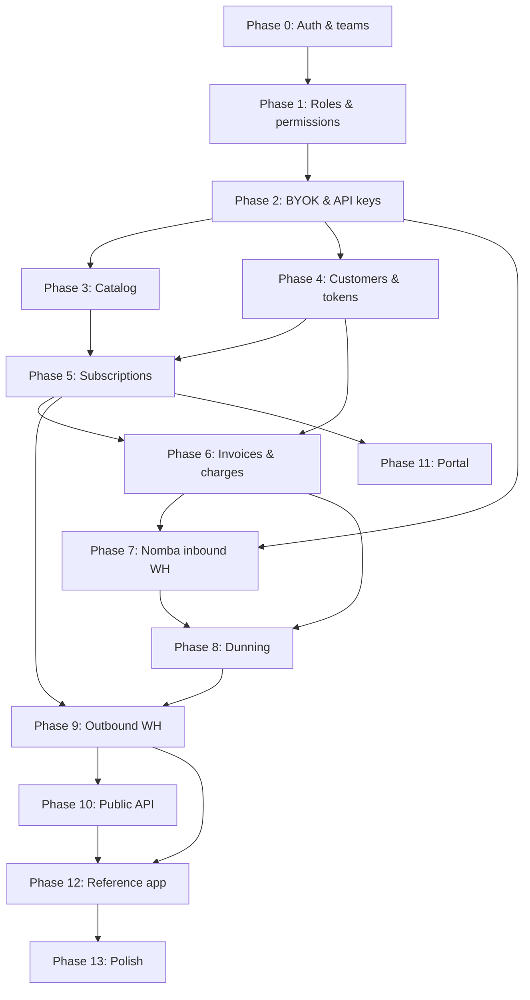

# Bouclay — Implementation Plan

Phased build plan for the hackathon subscriptions engine. Each phase has a clear outcome you can demo or test before moving on.

Authoritative schema: [`schema.md`](schema.md)

---

## Phase 0 — Foundation ✅ (done)

**Goal:** Runnable app with auth and multi-tenant teams.

**Deliverables:**

- Laravel + Inertia + Fortify
- `teams`, `team_members`, `team_invitations`, `users.current_team_id`
- Team dashboard shell, settings, invitations
- 3-step signup wizard: account details (first/last name, email, password) → business details (business name, business type, website) → business address (country, address lines, city, postal code)

**Exit criteria:** User can register through the 3-step wizard, own a personal team pre-filled with their business details, invite members, switch teams.

**Note:** Phase 0 uses a legacy single-role enum (`owner` / `admin` / `member`). Phase 1 replaces this with the RBAC model in `schema.md`.

---

## Phase 1 — Roles & permissions ✅ (done)

**Goal:** Paddle-style RBAC before billing work — permissions on roles only, many roles per team member.

**Build:**

- Migrations: `permissions`, `roles`, `role_permission`, `team_member_roles`, `team_invitation_roles`
- Migrate `team_members`: drop `role` column, add `is_owner`; team creator gets `is_owner = true` + **Admin** role
- Seeder: default roles and permissions from [RBAC seed appendix](schema.md#rbac-seed-appendix) (`Admin`, `Finance`, `Invoicing`, `Subscription KPIs`, `Support`, `Technical`)
- `HasTeams` / policies: `$user->hasTeamPermission($team, 'invoices.manage')` unions permissions across assigned roles; `is_owner` guard for `team.delete` and `members.assign_roles`
- Team member UI: checkbox role assignment (like Paddle screenshot)
- Invitation flow: assign multiple roles on invite → copy to `team_member_roles` on accept
- Share effective permissions with Inertia (`TeamPermissions` DTO expands to match seeded permissions)

**Exit criteria:** Owner assigns Finance + Invoicing to a member; member can view invoices but cannot manage API keys; non-owner cannot delete team.

---

## Phase 2 — Tenancy & integrator credentials ✅ (done)

**Goal:** A team can connect to Bouclay as an integrator — Nomba BYOK + Bouclay API keys.

**Build:**

- `team_settings`, `team_processor_connections`, `api_keys` tables
- **Developers** promoted to a primary sidebar item (collapsible: Nomba Integration / API Keys / Webhooks) instead of buried in account settings
- Nomba Integration page — connect/test/disconnect per mode (test, live), type-to-confirm on live, credentials verified against Nomba's real token-issue endpoint before saving *(requires `integrations.manage`; `integrations.view` to read)*
- API Keys page — create (name, publishable/secret, test/live), reveal-once with copy-confirm-before-close, revoke; live keys blocked until a live Nomba connection exists *(requires `api_keys.manage`; `api_keys.view` to read)*
- Webhooks page — shared inbound URL (`team_processor_connections.inbound_webhook_token`), per-mode signing secret (pasted in from Nomba's dashboard, masked forever after save), rotate endpoint, "Send test event" self-check *(requires `webhooks.manage`; `webhooks.view` to read)*
- Minimal public `POST /webhooks/nomba/{token}` receiver — resolves the team and marks `webhook_verified_at`; no signature verification or event mapping yet (Phase 7)
- Overview onboarding checklist (business details, Nomba, API key, webhook) tying the four steps together, session-dismissible, deep-linking to the same permanent pages above

**Deferred to a later phase:** `idempotency_keys` table + middleware — belongs with Phase 10's API surface (there's no external write endpoint yet for it to guard).

**Exit criteria:** Team saves Nomba keys; dashboard displays `POST /webhooks/nomba/{token}`; team can create/revoke a Bouclay API key. ✅

---

## Phase 3 — Catalog (products, prices, trials) ✅ (done)

**Goal:** Integrators define what they sell.

**Build:**

- Migrations/models: `products`, `prices`, `price_tiers` (standard + graduated)
- Dashboard CRUD for products and prices (recurring: monthly, annual, custom interval)
- `trial_offers` + catalog UI, built to the full model — trial price is a real, independently-visible catalog price (free or paid), transitions to a regular price on the same product or a different one (`transition_to_different_product`), and can repeat for N iterations (`duration_iterations`). See [`CATALOG_DESIGN.md`](CATALOG_DESIGN.md) §7 for the UX rationale.
- Product detail is a single scrollable page (info, pricing, trials, metadata), not tabs — every create/edit action opens a side drawer, never a navigation
- All queries scoped by `team_id`

**Defer:** timestamp-duration trials (`duration_type: timestamp` — ship `relative` only), volume pricing model (ship graduated only), **payment links** (a shareable, hosted checkout URL generated per price — the "Create payment link" action on a price row is a Phase 11 self-service-portal companion, since it needs the same hosted-checkout building block).

**Exit criteria:** Team creates “Pro” product with monthly price and optional trial offer. ✅

---

## Phase 4 — Customers & payment methods

**Goal:** End-customers exist in Bouclay; cards tokenise via Nomba.

**UX/product spec:** [`CUSTOMERS_DESIGN.md`](CUSTOMERS_DESIGN.md) (full proposal — IA, list, detail hub, payment methods, tokenization journey, copy).

**Build:**

- `customers`, `addresses`, `payment_methods`
- Nomba client wrapper using **team's** keys from `team_processor_connections`
- Checkout / tokenise flow (Nomba checkout API → store `processor_token` on `payment_methods`)
- Customer CRUD in dashboard + API

**Exit criteria:** Team creates a customer, completes test checkout, payment method stored against customer.

### Decisions locked during design (2026-07-04) — do not re-litigate

Verified against Nomba's docs (via MCP) and Paddle's live dashboard. These shape the build; the reasoning lives in `CUSTOMERS_DESIGN.md` at the cited sections.

1. **Nomba tokenization = hosted full-redirect, tokenize-on-payment.** `POST /v1/checkout/order` with `tokenizeCard:true` + a **required real `amount`** → `{ checkoutLink, orderReference }` → redirect customer to `checkout.nomba.com/pay/…` → they pay on Nomba's page → callback to `callbackUrl?orderReference=…`. There is **no embedded card field and no $0 setup intent**. (CUSTOMERS_DESIGN §10.3)
2. **No "Add payment method" action anywhere** — matches Paddle. A card is saved only as the **byproduct of the customer paying a checkout**. The customer-detail **Payment Methods section is read-only** (list / set-default / remove; no Add button; not in the Actions menu, not in the empty state). (CUSTOMERS_DESIGN §7.4, §10.2, §10.5, §10.8)
3. **No verify-charge, no live-mode policy.** The token-minting charge is always a *real* payment the customer wanted (a one-time transaction or a subscription's first charge), never an artificial ₦50. Applies in both test and live. (CUSTOMERS_DESIGN §10.8)
4. **Collection modes = `manual | automatic`** (already in schema on `subscriptions`/`invoices`) surface as Paddle's two choices: *Manually, via invoice* (send checkout link) vs. *Automatically, using a stored payment method*. (CUSTOMERS_DESIGN §10.3)
5. **Token capture:** the exact `orderReference → tokenKey` tie is only in the `payment_success` **webhook**; `GET /v1/checkout/tokenized-card-data?customerEmail=` is the synchronous fallback (email-keyed). Extend the **existing Phase-2 `POST /webhooks/nomba/{token}` receiver** minimally to stash `tokenizedCardData` per order — NOT the full Phase 7 signature-verified event mapping. (CUSTOMERS_DESIGN §10.3, §14.8)
6. **Column mapping:** `processor_token`←`tokenKey`, `brand`←`cardType`, `last4`←`order.cardLast4Digits`, `exp_*`←`tokenExpiry*` (may be `N/A` → keep nullable). **`fingerprint` is unpopulatable** (Nomba returns none) → no cross-customer card dedupe. (CUSTOMERS_DESIGN §10.3, §10.6)
7. **`default_payment_method_id` on `customers` is canonical** for "default"; treat `payment_methods.is_default` as a derived mirror. (CUSTOMERS_DESIGN §14.9)
8. **"New business"** (Paddle's B2B entity on a customer) is **dropped** — no schema table for it. Revisit only if B2B invoicing becomes a goal (schema change, not a stub). (CUSTOMERS_DESIGN §7.4)
9. **List:** Paddle-thin — Email/Name/Status/Created, one **Status** filter (default Active), search, bulk **Archive** (soft-delete). Server-side search + pagination from the start (first table likely to grow large). No spend/subscription columns until the data exists (Phases 5–6). (CUSTOMERS_DESIGN §5, §14.2)
10. **Create/Edit** = side drawer (Bouclay's catalog idiom), minimal fields — **email required, name optional** (Paddle helper: "only required to bill by invoice"). (CUSTOMERS_DESIGN §6, §8)

### Way-forward decision: pull a **thin checkout slice** forward (Plan A) — NOT the transactions data model

Because Decision #2 removed the standalone "add card", the *only* way a card reaches Phase 4 is via a checkout — so Phase 4 must ship **one** checkout trigger to meet its own exit criteria. Chosen scope:

- **Build now (thin):** a minimal **"Charge customer"** one-time checkout — create Nomba checkout order (`tokenizeCard:true`, real amount) → redirect → callback verify (`GET /v1/transactions/accounts/single?orderReference=`) → capture token (webhook per Decision #5) → **persist the `payment_methods` row only**. Gate to **test mode** for Phase 4 (matches exit criteria; test cards = fake money). This is the entry point that appears in the Actions menu as "Charge customer".
- **Do NOT build:** `payments` / `invoices` / `invoice_lines` rows, invoice numbering, proration, tax, dunning. Reason: `payments.invoice_id` is NOT NULL → recording a payment drags in the whole invoicing model = all of Phase 6. Phase 4's checkout stores the **token/payment method only**; the money movement isn't recorded as a Bouclay `payment` until Phase 6 wires it. Acceptable because Phase 4 charges are test-mode setup, not accounted revenue.

**Why forward-pull the thin slice rather than defer to Phase 5/6:** (a) it's the only card-collection path now; (b) it **de-risks the hardest integration** — Nomba hosted-redirect + webhook token correlation — *before* Phase 5 subscriptions depend on it; (c) the checkout-order + token-capture primitive is **reused verbatim** by subscriptions (Phase 5) and invoicing (Phase 6).

**Carried into later phases (so we don't forget):**
- **Phase 5 (Subscriptions):** "Create subscription" reuses the Phase-4 checkout primitive for the first charge; enable **live-mode** card collection here (first subscription payment mints the live token). Un-disable the "Create subscription" action + section CTA on the customer page.
- **Phase 6 (Invoicing/Transactions):** promote "Charge customer" to record real `payments`/`invoices`; replace the customer-page **Transactions placeholder** with the real table in the same slot; add **Total spend** column to the list and spend cell to the Overview grid. Enable live-mode standalone charges.
- **Phase 7 (Inbound webhooks):** replace the Phase-4 *minimal* `tokenizedCardData` capture with full signature-verified event mapping.
- **Phase 9 (Outbound):** emit `customer.created` / `payment_method.added` events from the hooks Phase 4 already fires for the activity timeline.

---

## Phase 5 — Subscriptions & state machine ✅ (done)

**Goal:** Core subscription lifecycle without full invoicing yet.

**UX/product spec:** [`SUBSCRIPTIONS_DESIGN.md`](SUBSCRIPTIONS_DESIGN.md) (full proposal — IA, two-pane create, list, detail hub, state machine, trial-as-line-item, copy).

**Built:**

- `subscriptions`, `subscription_items`, `subscription_item_trials`, `scheduled_changes`
- Create subscription (line items + optional trial offer) via a two-pane create flow, reusing a shared `CreateSubscription` action so the future Phase-10 API is a thin wrapper (`items[]` = `{price}` | `{trial_offer}`)
- Hand-rolled **state machine** (no package) in `app/States/Subscription/` — a `SubscriptionState` contract, `BaseSubscriptionState` (throws by default), seven concrete states, `IllegalStateTransition`, and `Subscription::apply()`; `SubscriptionStatus` enum resolves state classes and carries UI `label()`/`color()`/`description()`
- `subscriptions.trial_ends_at` + trial-end-behavior fields; list, detail hub, and customer-page activation

**Exit criteria:** Customer subscribed to a plan; status visible; trial end date computed for free trial. ✅

### Decisions locked during design (2026-07-05) — do not re-litigate

Verified against Stripe's create-subscription dialog (see `SUBSCRIPTIONS_DESIGN.md`).

1. **Trials are line items, not a price property.** A subscription is a list of line items; each is a plain price (**Add product**) **or** a trial offer (**Add trial**). Adding a trial creates a `subscription_item` + a snapshotted `subscription_item_trials` row. Bouclay **never** auto-applies a trial because a chosen price is some offer's `transition_price_id`. (SUBSCRIPTIONS_DESIGN §3, §7.2, §17.2a)
2. **Free vs paid trial split (schema.md §5).** Free trial (`trial_price = 0`) → no charge, `trialing`. Paid trial (`trial_price > 0`) → billed the intro price at signup and each cycle, follows `incomplete → active` (**not** `trialing`), converts to `transition_price` at `trial_ends_at`. `current_period_end` = one **intro** cycle; `trial_ends_at` = the conversion point. (SUBSCRIPTIONS_DESIGN §10.2)
3. **A product appears at most once.** A plain line + a trial for the same product double-charges, so the create builder de-dupes by product and `CreateSubscription::resolveLines` rejects duplicate `product_id`.
4. **Collection modes** = the two Stripe/Paddle choices: *Automatically charge a saved card* (`automatic`) vs *Send an invoice to pay manually* (`manual`). Already on `subscriptions.collection_mode`; no new column.
5. **Money is staged (Phase 5/6 cut-line).** No `invoices`/`payments`/real Nomba charge this phase. `apply('activate')` **simulates** a successful first charge; hub Invoices/Payments are `StagedSection`s. (SUBSCRIPTIONS_DESIGN §17.6)

### Carried into later phases (so we don't forget)

The create-time seams are marked in code as `TODO(Phase 6)` in `CreateSubscription` (`grep -rn "TODO(Phase" app/`). The worker-driven transitions are **new callers that don't exist yet** — this list is their home:

- **Phase 6 (Invoicing/charges):**
  - Replace the **simulated first charge** in `CreateSubscription::settleInitialState` (`apply('activate')`) with a real Nomba charge → record `payment` + `invoice`; on decline leave `incomplete`.
  - **Automatic + no card** subscriptions currently **dead-end at `incomplete`** — generate the Phase-4 checkout link to collect the card, then flip to `active`/`trialing` on payment.
  - Add the **trial-conversion worker**: at `subscription_item_trials.ends_at`, swap the item `trial_price_id → transition_price_id`, mark the trial `converted`, and call `apply('convert')`.
  - Replace the hub **Upcoming invoices / Payments** `StagedSection`s with real tables (same slots); add real amounts to list/customer totals.
- **Phase 7 (Inbound webhooks):** drive `apply('activate')` / `apply('markPastDue')` from real Nomba `payment_success` / `payment_failed` events instead of the synchronous create-time assumption; clear the hub's "awaiting payment" banner on the webhook.
- **Phase 8 (Dunning):**
  - **Incomplete-timeout job** → `apply('expire')` for `incomplete` subs past their grace window (→ `incomplete_expired`).
  - **Renewal-failure → `apply('markPastDue')`**, then retry on `team_settings.dunning_config` (soft vs hard decline via `payments.failure_code`); recovery → `apply('recover')`; exhaustion → terminal `apply('cancel')`/`apply('pause')` per config.
  - **Manual-invoice unpaid path is distinct** from automatic retry: there's no card to retry, so it's reminder-based → age the invoice → `past_due` → terminal. Don't collapse it into the automatic retry loop.
  - The **scheduled-changes worker** applies `cancel`/`pause`/`resume` rows at `effective_at` (Phase 5 writes the rows; the worker that fires them lands here).
- **Phase 9 (Outbound):** emit `subscription.created` / `.updated` / `.trial_will_end` from the same lifecycle hooks that already write the timeline in Phase 5.

**State-machine transition owners** (the machine is complete; these are the *callers* still to wire):

| Transition | Fires when | Caller wired in |
|---|---|---|
| `activate` | first payment captured | **5** (simulated at create) → **6/7** (real charge / webhook) |
| `pause` / `resume` / `cancel` (immediate) | dashboard action | **5** ✅ |
| cancel/pause/resume at period end | `scheduled_changes` row reaches `effective_at` | **5** writes row → **6/8** worker fires |
| `convert` | trial reaches `ends_at` | **6/8** trial-conversion worker |
| `markPastDue` | renewal charge fails / invoice past due | **6** (charge) / **7** (webhook) |
| `recover` | a dunning retry succeeds | **8** |
| `expire` | `incomplete` sub exceeds grace window | **8** |

---

## Phase 6 — Invoicing, charges & proration

**Goal:** Money moves on a schedule; upgrades/downgrades prorate.

**Build:**

- `invoices`, `invoice_lines`, `payments`
- Period billing worker: generate invoice at `current_period_end`
- Charge via Nomba using team keys; record attempt on `payments`
- Proration on subscription item changes (invoice lines with `kind: proration`)
- Invoice numbering from `team_settings`

**Exit criteria:** Renewal generates invoice; test charge succeeds; plan change produces proration line.

---

## Phase 7 — Nomba inbound webhooks

**Goal:** Payment outcomes drive subscription state (not just synchronous API responses).

**Build:**

- Replace hardcoded webhook route with `POST /webhooks/nomba/{inbound_webhook_token}`
- Resolve team from token; verify Nomba signature
- Map events → update `payments`, `invoices`, `subscriptions` (paid, failed, etc.)
- Idempotent processing (store processor reference)

**Exit criteria:** Simulated or real Nomba webhook moves invoice to `paid` and subscription to `active`.

---

## Phase 8 — Dunning & failed-payment recovery

**Goal:** Hackathon “dunning sophistication” — retries and terminal actions.

**Build:**

- `team_settings.dunning_config` — retry schedule, max attempts
- Scheduler: `past_due` subs, retry charges with backoff
- Hard vs soft decline classification (`payments.failure_code`)
- Terminal actions: cancel, pause, or leave open (`incomplete_expired` path)
- `scheduled_changes` for cancel-at-period-end

**Exit criteria:** Failed charge triggers retries; after max attempts subscription reaches configured terminal state.

---

## Phase 9 — Outbound webhooks & events

**Goal:** Downstream developers integrate without polling.

**Build:**

- `events`, `webhook_endpoints`, `webhook_deliveries`
- Emit on lifecycle: `subscription.created`, `subscription.updated`, `invoice.paid`, `invoice.payment_failed`, etc.
- HMAC signing with endpoint secret; exponential backoff delivery worker
- Dashboard: register webhook URL + signing secret; delivery log

**Exit criteria:** Integrator URL receives signed `invoice.paid` after successful charge.

---

## Phase 10 — Billing API surface

**Goal:** API ergonomics for downstream developers.

**Build:**

- Versioned API routes (`/api/v1/...`) authenticated with Bouclay secret key + team scope
- Core resources: customers, products, prices, subscriptions, invoices
- Idempotency-Key header on POST/PATCH
- Consistent error shape; test vs live mode from key

**Exit criteria:** Full happy path runnable via HTTP client (create customer → subscribe → receive webhook).

---

## Phase 11 — Self-service portal (minimal)

**Goal:** Hackathon “customer self-service portal” — thin, not a second product.

**Build:**

- Customer-facing pages or hosted portal links (team-branded minimal UI)
- View subscription status, update payment method, cancel at period end
- Authenticated by magic link or customer portal token
- **Payment links** — a "Create payment link" action per price (seen in the Catalog price-row menu) that generates a shareable hosted checkout URL for that exact price, reusing this phase's hosted-portal UI shell

**Exit criteria:** End customer can cancel subscription without support.

---

## Phase 12 — Reference integrator app (“Acme Notes”)

**Goal:** Prove the integrator story live.

**Build:**

- Tiny app (or section) that uses Bouclay API + outbound webhooks only
- One plan, subscribe button, paywall gated on webhook/`subscription.active`
- Does **not** talk to Nomba directly

**Exit criteria:** End-to-end demo: Acme connects Nomba → creates plan → user subscribes → Acme webhook fires → access granted.

---

## Phase 13 — Polish & defer bucket

**Goal:** Judge-ready demo and docs.

**Build:**

- README API examples; Postman collection optional
- Feature tests for state machine and dunning paths
- Dashboard empty states, loading, error handling

**Explicitly defer (schema present, logic later):**

- `discounts` / `discount_redemptions`
- `refunds`
- `price_currency_options`
- Metered billing (removed from schema)
- Paid / transition / timestamp trial variants

---

## Suggested timeline (hackathon)

| Order | Phase | Priority |
|---|---|---|
| 1 | Phase 1 — Roles & permissions | P0 |
| 2 | Phase 2 — Credentials | P0 |
| 3 | Phase 3 — Catalog | P0 |
| 4 | Phase 4 — Customers & PMs | P0 |
| 5 | Phase 5 — Subscriptions | P0 |
| 6 | Phase 7 — Inbound webhooks | P0 |
| 7 | Phase 6 — Invoicing & charge | P0 |
| 8 | Phase 8 — Dunning | P0 |
| 9 | Phase 9 — Outbound webhooks | P0 |
| 10 | Phase 12 — Reference app | P0 for demo |
| 11 | Phase 10 — API polish | P1 |
| 12 | Phase 11 — Portal | P1 |
| 13 | Phase 13 — Polish | P1 |

Phases 6 and 7 can overlap once charge API works synchronously; inbound webhooks should land before relying on them for dunning.

---

## Dependency graph

---

## Definition of done (hackathon demo)

1. Integrator team connects Nomba keys and pastes inbound webhook URL.
2. Integrator creates product + monthly price (+ optional free trial).
3. End customer subscribes; card tokenised; subscription reaches `active` or `trialing`.
4. Renewal or initial charge produces invoice + Nomba charge on **integrator's** Nomba account.
5. Failed payment enters dunning; retries visible.
6. Outbound webhook delivers `invoice.paid` (or failure event) to integrator URL.
7. Reference app gates access from Bouclay webhook — no direct Nomba integration in app.
