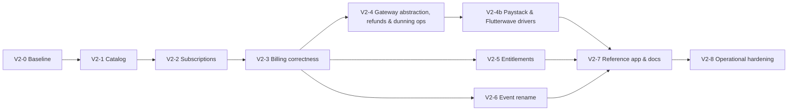

# Bouclay — Implementation Plan V2 (Catalog Rework → Production-Ready)

Gets the codebase from its current state (Phases 0–11 of [`IMPLEMENTATION.md`](IMPLEMENTATION.md), built on the *old* schema) to the reworked target in [`schema.md`](schema.md), validated by [`BILLING_SIMULATIONS.md`](BILLING_SIMULATIONS.md), and operationally smooth to run — not just demo-ready.

**Read first:** `schema.md` (authoritative data model, all decisions locked), `BILLING_SIMULATIONS.md` (SIM-01…04 + ADV-01…10 — these are the acceptance tests).

---

## 1. Where we are vs. where we're going

Phases 0–11 shipped a working engine on the **pre-rework** schema. The rework changes the catalog's shape and hardens billing correctness. The delta:

| Area | Built today | Target (schema.md) |
|---|---|---|
| Catalog hierarchy | `products → prices` (flat) | `products → plans → prices` — plans are the tier ("Pro"), prices its billable variants |
| Trials | `trial_offers` + `subscription_item_trials` (two-slot: trial price → transition price) | simple trials on `prices.trial_*`; complex/ramp cases via generic `price_phases`; anti-abuse via `price_trial_redemptions` |
| Price edits | mutate row, `version` counter | **immutable**: edits create a new row (`replaces_price_id`), archive old; `purchasable` hides phase-only prices |
| Subscription items | `price_id` + `product_id` | + `plan_id`, `kind` (plan/addon), `trial_ends_at` snapshot, `current_phase_sequence` |
| Scheduled changes | `cancel`/`pause`/`resume` | + `update` (deferred downgrades/quantity/removal with payload) |
| Discounts | schema designed, not migrated, no logic | full engine: `discounts`, `discount_redemptions.remaining_intervals`, renewal application, line-level `discount_amount` invariant |
| Invoices | `customer_id`, no type, no name snapshots | + `billed_to_customer_id`, `type` (charge/credit), line `*_name_snapshot` columns, new `kind` values (plan/addon/credit) |
| Refunds | `payments.status=refunded` only | `refunds` table (partial amounts, reason, processor ref) + refund action |
| Entitlements | none | `entitlements` + polymorphic `entitlement_grants`, access-resolution API |
| Outbound events | concrete names (`invoice.paid`, `payment_method.added`, …) | `*.created` / `*.updated` pairs, status read from payload |
| Dunning | backend defaults, no UI | spec'd `dunning_config` shape + editable settings UI |
| Gateways | Nomba hard-coded 3 ways: `nomba_*` credential columns + `unique(team_id)` (one gateway per team, ever), `ChargeInvoice` → `NombaCheckout` directly, `/webhooks/nomba/{token}` only | driver architecture: `unique(team_id, processor)` + encrypted-JSON credentials shaped by each driver's `configSchema()` manifest, `PaymentGateway` interface + `GatewayManager`, `/webhooks/{processor}/{token}`; **tokens gateway-bound** (stored cards charge via their minting gateway; `is_default` = new checkouts only). **Paystack + Flutterwave drivers ship in V2-4b** on a shared contract-test suite; further gateways = one driver class, zero migrations |
| Multi-tenancy, RBAC, API, portal, state machine | ✅ solid | unchanged — carried forward as-is |

**What is deliberately NOT changing:** integer PKs + `HasPublicId` (the codebase convention stands; `schema.md`'s `ulid` column notation reads as "id + public_id pair"), the hand-rolled state machine, the shared-Action pattern (`CreateSubscription`, `CreateInvoice`, `ChargeInvoice`), Wayfinder routes, drawer/page UI idioms, Nomba tokenize-on-payment.

---

## 2. Migration strategy (the one big call)

**Squash to a clean V2 baseline.** Bouclay is pre-launch with no external tenants: rewrite the migration set to match `schema.md` exactly, `migrate:fresh --seed`, and rebuild demo data through a seeder. No dual-schema period, no legacy columns, no transform scripts to maintain.

- Old migrations are deleted, not edited — the V2 set is written fresh in the FK-safe order documented in `schema.md` § Migration order.
- Factories and seeders are regenerated against the new tables in the same phase (a `DemoTeamSeeder` builds the NaijaStream fixture from `BILLING_SIMULATIONS.md` so every dev/demo environment starts with a realistic catalog).
- **Confirmed 2026-07-10: no existing data survives.** All current rows (including live-mode demo charges) are disposable; `migrate:fresh` with no export step. If a familiar catalog is wanted afterward, re-enter it through the UI — a former trial offer becomes a price with `trial_length` set (simple case) or a two-phase `price_phases` chain (transition case).

---

## 3. Phases

Each phase ends green: `composer test` passes, PHPStan clean (ignore the 7 known pre-existing errors), `php artisan wayfinder:generate` run after route changes. Simulation tests are written **with** the phase that makes them passable, not after.

### V2-0 — Baseline reset & test scaffolding

**Goal:** the new schema exists, the app boots on it, and the simulation suite exists as executable (mostly-todo) specs.

- New migration set per `schema.md` (all tables, FK-safe order, deferred circular FKs as documented) — **including the generalized `team_processor_connections`** (`processor` + `unique(team_id, processor)` + `is_default` + encrypted-JSON `test_credentials`/`live_credentials`); the Nomba connect form and `NombaClient` keep working against the JSON blob in this phase, driver interface comes in V2-4.
- Models/enums updated: `Plan`, `PricePhase`, `PriceTrialRedemption`, `Entitlement`, `EntitlementGrant`, `Discount`, `DiscountRedemption`, `Refund`; drop `TrialOffer`, `SubscriptionItemTrial`. Enum classes regenerated from the Enums appendix (`ScheduledChangeAction` gains `Update`, `InvoiceLineKind` gains `Plan`/`Addon`/`Credit`, etc.).
- `Relation::enforceMorphMap(['plan' => Plan::class, 'product' => Product::class])` in the AppServiceProvider (grantor aliases; `customer` reserved).
- Factories + `DemoTeamSeeder` (NaijaStream fixture).
- RBAC seed: add `plans.view/manage`, `entitlements.view/manage`, `discounts.view/manage`, `refunds.*` already seeded — follow the 4-place permission convention for each.
- Test scaffolding: one Pest file per simulation — `tests/Feature/Simulations/Sim01HappyPathTest.php` … `Adv10MultiCurrencyTest.php` — with the fixture builder shared via a Pest helper. Assertions from the doc land as `todo()` cases, promoted phase by phase.

**Exit:** app boots, auth/teams/RBAC/BYOK all still pass, `migrate:fresh --seed` produces the NaijaStream catalog, simulation files enumerate every SIM/ADV case.

### V2-1 — Catalog: plans, immutable prices, phases

**Goal:** merchants author the new catalog end to end.

- **Plans CRUD** in the product detail page (drawer idiom): draft/active/archived; the draft/archived-plan purchasability rule enforced in one `Price::purchasableForNewSubscriptions()` query scope used by every picker, payment link, and API validator.
- **Price immutability service:** `CreatePrice` + `ReplacePrice` actions. `ReplacePrice` creates the successor (`replaces_price_id`, `version+1`), archives the original, and is the **only** write path once a price is referenced — enforce with a model-level guard (`Price::saving` throws if a referenced row mutates a frozen column). Editing UI reads as "edit", executes as replace.
- **`price_phases` authoring:** phase list editor on a price (sequence, charge price picker, duration). Auto-created charge prices default `purchasable=false`.
- **Trials on prices:** `trial_length`/`trial_unit`/`trial_requires_payment_info`/`trial_once_per_customer` in the price form; `price_trial_redemptions` written at subscription time (V2-2).
- **Payment links** re-pointed at plan-bearing prices; free-trial links now key off `prices.trial_*` instead of `trial_offers`.
- **API v1:** `/plans` resource added; `/prices` nested under plan context; `/trial-offers` endpoints removed (pre-launch — no deprecation window needed).

**Exit:** SIM-04 (price edit → grandfathering) passes. NaijaStream fixture creatable entirely through the UI. A phase-only price never appears in any picker.

### V2-2 — Subscriptions on the new catalog

**Goal:** create/manage subscriptions against plans, with the locked trial and cadence rules.

- `CreateSubscription` rework: items are `{price_id, quantity}` against plan-bearing recurring prices; `plan_id`/`product_id`/`kind` denormalised on the item; plan-less prices rejected (schema.md constraint).
- **Single-cadence validation** (GAP-5): create + item-update reject mixed `billing_interval`/`billing_frequency`.
- **Trial anchoring** (GAP-4, Stripe-style): subscription trial anchors to the base plan item; no-trial add-ons ride it — no invoice at day 0 on a free trial; first invoice at conversion bundles plan + add-ons. `trial_ends_at` snapshotted onto the item, mirrored to the subscription (earliest active).
- `price_trial_redemptions` written on trial start; `trial_once_per_customer` enforced with a clear validation error.
- **Phase progression:** generalize the trial-conversion worker into `subscriptions:advance-phases` — advances `current_phase_sequence` at phase boundaries, swaps effective price, converts trials (a simple trial is the degenerate single-boundary case). Free trial → `trialing`; paid phase-0 → `incomplete → active` per schema.md §5.
- Two-pane create flow updated: pick plan → pick variant price; "Add trial" becomes picking a trial-bearing price (or a phased price).

**Exit:** SIM-01 Acts 1–3 pass (signup → trial → conversion invoice with correct totals). ADV-05 passes (mixed cadence rejected). Paid-trial path covered by a phase-0 test (this also unblocks the previously-deferred paid trial links).

### V2-3 — Billing correctness: discounts, snapshots, mid-cycle policy

**Goal:** money math is invariant-true and every locked policy is executable.

- **Invoice hardening:** `billed_to_customer_id` (= `customer_id` for now), `invoices.type`, line `product/plan/price_name_snapshot` populated in `CreateInvoice` at finalize; `invoice_lines.kind` new values wired through dashboards and PDF.
- **Discount engine:** `discounts` CRUD (+ eligibility per the `eligible_price_ids`-wins rule), redemption at subscribe, renewal worker applies while `remaining_intervals` is null/>0 then decrements and stamps `last_applied_at`. Application writes **per-line `discount_amount` only** (the schema.md invariant); `discount_total = SUM(discount_amount)` asserted in `CreateInvoice`.
- **Mid-cycle policy** (GAP-2/3/6): `proration_behavior` request param on `UpdateSubscriptionItem` (`always`/`none`/`next_cycle`; defaults: increase→`always`, decrease→`next_cycle`, trialing→immediate-no-proration). Decrease/removal writes `scheduled_changes{action: update, payload}`; `subscriptions:apply-scheduled-changes` applies item payloads at `effective_at`. Pending updates surfaced + deletable on the subscription hub.

**Exit:** SIM-01 Act 4 (repeating discount stops after interval 3), SIM-02 (increase proration, exact minor-unit assertions), SIM-03 (decrease defers, renewal bills new quantity with no proration lines), ADV-01…04, ADV-08 all pass.

### V2-4 — Gateway abstraction, refunds & dunning operations

**Goal:** every processor touchpoint goes through one driver boundary, and the "operate real money" surfaces (refunds, dunning) are complete on top of it.

- **`PaymentGateway` interface + `GatewayManager`** (`app/Services/Gateways/`): `configSchema()`, `capabilities()`, `verifyCredentials()`, `createCheckout()`, `chargeToken()`, `verifyCharge()`, `refund()`, `verifyWebhookSignature()`, `parseWebhookEvent()`. `NombaGateway` wraps the existing `NombaClient`/`NombaCheckout` — a refactor, not a rewrite; behavior identical, proven by the existing suites staying green.
- **Call-site sweep:** `ChargeInvoice`, checkout/tokenization flows, and the refund action resolve the driver via `payment_methods.processor` → connection row → `GatewayManager::driver()`. No `Nomba*` class is referenced outside the driver after this phase (grep-enforced in a test).
- **Manifest-driven connect UI:** the Developers → gateway connection page renders its form from the driver's `configSchema()` (field keys, labels, secret masking, per-mode) instead of hard-coded Nomba fields; saves validate against the manifest and store encrypted JSON.
- **Webhook route generalized** to `/webhooks/{processor}/{token}`: resolve connection → driver `verifyWebhookSignature()` → driver `parseWebhookEvent()` normalizes to the internal shape → shared settlement action (written once) applies it. `/webhooks/nomba/{token}` kept as an alias so nothing already pasted into Nomba dashboards breaks.
- **The smoothness contract:** adding a gateway is one driver class implementing the interface + a registry entry — connect form, checkout, charge, refund, webhooks all light up from the manifest. **Zero migrations.** Proven in this phase by `NombaGateway` + a `FakeGateway` in tests, then exercised for real by V2-4b's Paystack and Flutterwave drivers.
- `refunds`: dashboard action on a succeeded payment (partial amount + reason), refund call **through the driver** (`capabilities()` gates the button — a gateway without refund support renders the action disabled with copy, never a mid-flight failure), `refunds` row + `payments.status=refunded` when fully reversed; portal payments page shows refund state. `refunds.process` permission gates it.
- **Dunning settings UI** (Phase-8 deferral): editable retry schedule + terminal action editing `dunning_config` per the schema.md shape; read-only billing settings page becomes writable. Hard-decline skip behavior surfaced in copy.
- SIM-01 Act 5 (three attempts, one invoice) and Act 6 (partial refund) converted from todo to passing.

**Exit:** refund round-trips against Nomba test mode **through the driver**; grep test proves no `Nomba*` reference outside `app/Services/Gateways/`; `FakeGateway` exercises the full contract (checkout → token → charge → webhook → refund) in tests; connect form renders from the manifest; dunning schedule editable and respected by `subscriptions:process-dunning`; ADV-06 (card swap mid-dunning) passes.

### V2-4b — Paystack & Flutterwave drivers

**Goal:** two more real gateways ship on the V2-4 contract — which is also the proof the abstraction isn't Nomba-shaped in disguise. Both follow the same tokenize-on-payment model as Nomba (a card token is minted as the byproduct of a real hosted-checkout payment), so no product-flow changes — only drivers.

- **`PaystackGateway`.** Manifest: `{secret_key, public_key}` per mode (`sk_test_`/`sk_live_` prefixes validated on save). Checkout: `POST /transaction/initialize` → `authorization_url` (hosted page). Verify: `GET /transaction/verify/{reference}`. Token: the `authorization_code` returned on successful charge → stored as `payment_methods.processor_token`; recurring charge via `POST /transaction/charge_authorization`. Refund: `POST /refund`. Webhooks: HMAC-SHA512 of the raw body with the **secret key** (`x-paystack-signature`) — no separate webhook secret field; `charge.success` / `refund.processed` mapped by `parseWebhookEvent()`.
- **`FlutterwaveGateway`.** Manifest: `{secret_key, public_key, encryption_key, webhook_secret_hash}` per mode. Checkout: Standard `POST /v3/payments` → hosted `link`. Verify: `GET /v3/transactions/{id}/verify`. Token: `data.card.token` from the completed charge; recurring charge via `POST /v3/tokenized-charges`. Refund: `POST /v3/transactions/{id}/refund`. Webhooks: `verif-hash` header compared against the stored secret hash; `charge.completed` (success/failure) mapped by `parseWebhookEvent()`.
- **Shared gateway contract test suite:** one Pest dataset-driven suite runs the identical scenario set against every registered driver (`Http::fake` per gateway's wire format): connect-form render from manifest → credential verify → checkout create → webhook settles payment + mints token → renewal charge on token → failed charge classified hard/soft for dunning → partial refund. A new driver passes by adding itself to the dataset.
- **Capabilities declared honestly:** currencies per gateway (Paystack: NGN/GHS/ZAR/KES/USD; Flutterwave: NGN + multi-currency; Nomba: NGN), partial-refund support, tokenization — validators read these (e.g. a USD price can't create a checkout on a gateway that can't settle USD).
- **Dashboard:** the gateway list page shows all three with connect status; "Send test event" self-check works per connection; default-gateway picker (governs new checkouts only — the token-bound routing rule from `schema.md` is already enforced at the V2-4 layer).
- **Dunning decline mapping per driver:** each driver maps its gateway's failure codes into Bouclay's hard/soft decline classification so `subscriptions:process-dunning` behaves consistently regardless of which gateway minted the token.

**Exit:** the full contract suite is green for `nomba`, `paystack`, `flutterwave`, and `fake`; a subscription created on a Paystack-tokenized card renews, fails, dunns, recovers, and refunds identically to the Nomba path; test-mode smoke (Paystack + Flutterwave test cards) completes checkout → token → renewal → refund on both.

### V2-5 — Entitlements

**Goal:** integrators check access without touching billing internals.

- `entitlements` CRUD (Developers section or Catalog — code is the API contract), grants editor on plan/product pages.
- **Resolver:** `Customer::entitlements()` — union of grants across plans/products on subscriptions in `trialing`/`active`/`past_due`-within-grace; honors `ends_at`.
- API: `GET /api/v1/customers/{id}/entitlements`; entitlement codes included in `subscription.*` event payloads so integrators can gate on webhooks alone.

**Exit:** SIM-01 access-check assertions pass (grants present while trialing/active, gone after cancel `ends_at`). Reference app (V2-7) gates a feature purely on the entitlements endpoint.

### V2-6 — Outbound event rename

**Goal:** the `*.created`/`*.updated` target convention ships as one atomic, documented break.

- `OutboundEventType` collapsed to pairs for customer, payment_method, product, plan, subscription, invoice, payment; every emission site updated; payloads carry full object + `status`.
- The three webhook test suites updated; docs list the event catalog; reference app handler consumes the new names.
- Do this **before** any external integrator exists — it's a rename, not a versioning exercise, precisely because we're pre-launch.

**Exit:** delivery log shows only new-style names; grep finds no `invoice.paid`/`payment_method.added` emitters; SIM event assertions flipped to new names.

### V2-7 — Reference app, docs & demo path (absorbs old P12/P13)

**Goal:** the integrator story proven on the *new* surface.

- "Acme Notes": Bouclay API + webhooks only — create customer → subscribe to a plan → paywall gated on `subscription.updated` + entitlements endpoint. No direct Nomba calls.
- API docs/README examples regenerated for the new catalog (products/plans/prices, phases, discounts, entitlements, refunds); Postman collection optional.
- Portal polish carried from Phase 11: magic-link invite, invoice PDF download.
- Full **smoke run** scripted as a checklist: live-mode on Nomba (connect → author catalog → payment-link subscribe → renewal → failed-payment dunning → refund → webhooks observed), plus test-mode passes on Paystack and Flutterwave with their test cards covering checkout → token → renewal → refund.

**Exit:** end-to-end demo runs on live keys following the checklist, no manual DB touches.

### V2-8 — Operational smoothness (continuous, hardens at the end)

**Goal:** "very smooth to operate" — the engine runs itself and tells you when it doesn't.

- **Scheduler audit:** every worker (`bill-renewals`, `advance-phases`, `apply-scheduled-changes`, `process-dunning`, `process-manual-dunning`, `expire-incomplete`, `webhooks:deliver-pending`) registered with `onOneServer`, `withoutOverlapping`, and sane frequencies; `schedule:list` output documented.
- **`billing:health` command** — one operational snapshot: overdue-but-unbilled subscriptions, stuck `draft` invoices, `webhook_deliveries` failing > N attempts, phase boundaries missed, dunning backlog. Non-zero exit on red so it can back an uptime check.
- **Idempotency & replay:** all workers re-runnable (already largely true — assert it with double-run tests on renewal + phase advancement).
- **RUNBOOK.md:** worker cadences, what each health red flag means and the fix, Nomba outage behavior, how to re-drive a failed webhook delivery, how to hand-settle an invoice.
- Structured logs on every money mutation (invoice finalize, charge, refund, discount application) with team/customer/invoice public IDs.

**Exit:** `billing:health` green on the demo environment; a killed-mid-run renewal worker re-runs safely; runbook covers every red state the health command can report.

---

## 4. Test strategy

- **The simulations are the spec.** Every SIM/ADV case from `BILLING_SIMULATIONS.md` becomes a Pest feature test asserting exact minor-unit amounts, row writes, and emitted events. Promote `todo()` → passing within the phase that builds the behavior (mapping in §3 exit criteria).
- SQLite-in-memory constraints apply (no `ilike`; Postgres-only SQL forbidden in app queries).
- Nomba is always `Http::fake()` in tests; the live-mode smoke checklist (V2-7) is the only real-network validation.
- Regression floor: the existing suites (RBAC, catalog, customers, subscriptions, invoicing, dunning, webhooks, API, portal) must stay green through every phase — V2-0's squash is the only step allowed to rewrite them wholesale.

## 5. Sequencing

V2-4/5/6 are parallelizable after V2-3; V2-4b follows V2-4 strictly (drivers implement the contract the abstraction defines). Rough weighting: V2-0 and V2-3 are the heavy phases (schema reset; money invariants), V2-1/2/4 medium, V2-4b medium (two real API integrations, but no product-flow changes), V2-5/6 light, V2-7/8 integration work.

## 6. Definition of done (production-ready, supersedes the hackathon DoD)

1. Every SIM-01…04 and ADV-01…10 test passes (no remaining `todo()`).
2. Live-mode smoke checklist completes end to end, including a refund and a dunning recovery.
3. Catalog authored via UI only; a price edit never mutates a referenced row (guard test proves it).
4. Discount math holds its invariant on every invoice (`discount_total == SUM(line discount_amount)` asserted in code, not just tests).
5. Outbound events are `*.created`/`*.updated` only; reference app gates access via webhook + entitlements endpoint with no Nomba coupling.
6. `billing:health` green; runbook exists; all workers idempotent and scheduled `onOneServer`.
7. Merchant can self-serve: dunning settings, catalog, refunds, portal links — no operator DB access for any routine task.
8. Gateway-agnostic in fact, not just in shape: **three real drivers** (`nomba`, `paystack`, `flutterwave`) + `FakeGateway` all green on the shared contract suite; no processor class referenced outside the driver layer; a subscription behaves identically (renewal, dunning, refund) regardless of which gateway minted its card token; adding a fourth gateway is one driver class + registry entry with zero migrations.
