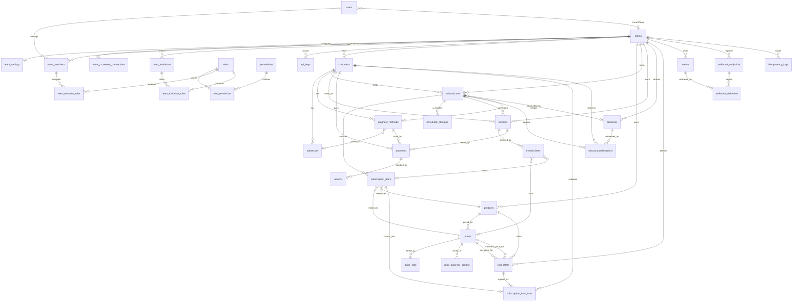

# Bouclay — Database Schema

Processor-agnostic subscription billing engine (Laravel). This is the authoritative data model: every table, field, type, relationship, and enum. It supersedes the Figma "Plan Board". Built on the Stripe/Paddle billing model — Laravel Cashier Paddle only ships four tables (`customers`, `subscriptions`, `subscription_items`, `transactions`) because Paddle is the merchant-of-record and owns the catalog; Bouclay *is* the engine, so it models everything Paddle keeps server-side.

---

## Conventions

These apply to every table — assume them rather than repeating per row.

- **Primary key**: `ulid` column named `id`.
- **Money**: always `bigInteger` in **minor units** (kobo/cents) paired with an ISO-4217 `currency` `char(3)`. Never floats.
- **Tenancy**: every tenant-owned table carries `team_id` (`ulid`, FK, indexed). All queries scope by it; workers never trust a join to infer the tenant. Staff access the dashboard through `team_members`; `users.current_team_id` is the active tenant context in the session.
- **Flexibility**: `custom_data` `json` (nullable) on the major entities — Paddle's `custom_data` / Stripe's `metadata`. Avoids a polymorphic metadata table.
- **Timestamps**: `created_at` + `updated_at` on every table. `deleted_at` (SoftDeletes) on catalog and customer rows only.
- **Enums**: stored as `string`, cast to PHP enums in the model. Values listed per column and collected in the [Enums appendix](#enums-appendix).
- **Idempotency**: all external write endpoints gate on `idempotency_keys`.
- **Processor (Nomba BYOK)**: each team connects **their own** Nomba API keys. Bouclay charges and tokenises on their merchant account; settlement stays with Nomba. Bouclay exposes a **generated inbound webhook URL** per team for the Nomba dashboard; integrators register **outbound** URLs in `webhook_endpoints` for subscription lifecycle events.
- **Authorization**: Spatie-lite RBAC — `permissions` attach to `roles` only; staff receive permissions through **roles assigned per `team_members` row** (many roles per member, Paddle-style). No direct user permissions. Gate dashboard routes and APIs with `$user->hasTeamPermission($team, 'invoices.manage')`, which unions permissions across all roles on that membership.

---

## Entity Relationship Diagram

> Note: `team_id` lives on nearly every billing table; the diagram only draws the team edges to aggregate roots to stay legible.

---

## 1. Platform & Tenancy

### `teams`
The tenant / merchant using Bouclay. **Already implemented** in the app (`Team` model); billing tables attach via `team_id`.

| Column | Type | Null | Notes |
|---|---|---|---|
| id | ulid | no | PK |
| name | string | no | business name, collected at signup |
| slug | string | no | unique; route key |
| is_personal | boolean | no | default false; auto-created personal workspace on signup |
| business_type | string | yes | enum: `individual` / `private` / `public`; collected at signup |
| website | string | yes | |
| country | char(2) | yes | ISO-3166; business address, collected at signup |
| line1 | string | yes | business address street line 1 |
| line2 | string | yes | business address street line 2 |
| city | string | yes | business address city/town |
| postal_code | string | yes | business address postal/zip code |
| default_currency | char(3) | no | billing default for this team |
| custom_data | json | yes | |
| created_at / updated_at / deleted_at | timestamp | yes | SoftDeletes |

The `business_type` / `website` / `country` / `line1` / `line2` / `city` / `postal_code` columns are nullable at the schema level (teams created later via "create team" only carry a name), but the signup flow requires all of them except `website` and `line2`. This is the team's *own* business address — distinct from `addresses`, which stores each *customer's* billing/shipping address.

### `team_settings`
One row per team — invoice numbering, dunning, and other billing config tenants tweak.

| Column | Type | Null | Notes |
|---|---|---|---|
| id | ulid | no | PK |
| team_id | ulid | no | FK → teams, unique |
| invoice_prefix | string | no | e.g. `BCL` |
| next_invoice_number | unsignedBigInteger | no | sequence counter, default 1 |
| invoice_template | string | yes | template key |
| invoice_footer | text | yes | |
| billing_timezone | string | no | e.g. `Africa/Lagos`; anchors when "due today" fires |
| tax_behavior | string | no | enum: `inclusive` / `exclusive` — team default |
| dunning_config | json | yes | retry schedule + terminal action override |
| created_at / updated_at | timestamp | no | |

### `team_processor_connections`
Bring-your-own-key (BYOK) link between a team and Nomba — like connecting API keys on OpenCode. Created when a team first connects Nomba; the **Nomba webhook URL** is generated here and shown in the dashboard for paste into Nomba.

Nomba authenticates via OAuth2 client-credentials (`accountId` + `clientId` + `clientSecret` exchanged for a short-lived access token via `POST /v1/auth/token/issue`), not a single static secret key — hence three credential fields per environment instead of one. Access/refresh tokens themselves are never persisted; `NombaClient` re-mints and caches them on demand.

| Column | Type | Null | Notes |
|---|---|---|---|
| id | ulid | no | PK |
| team_id | ulid | no | FK → teams, unique |
| processor | string | no | enum: `nomba`; extensible |
| nomba_test_account_id | text | yes | encrypted; parent business account, always authenticates |
| nomba_test_subaccount_id | text | yes | encrypted; optional — when set, business-operation requests scope to this instead of the parent account |
| nomba_test_client_id | text | yes | encrypted |
| nomba_test_client_secret | text | yes | encrypted |
| nomba_live_account_id | text | yes | encrypted |
| nomba_live_subaccount_id | text | yes | encrypted |
| nomba_live_client_id | text | yes | encrypted |
| nomba_live_client_secret | text | yes | encrypted |
| inbound_webhook_token | string | no | unique; unguessable segment in the Nomba → Bouclay URL |
| webhook_verified_at | timestamp | yes | set when the inbound URL has actually received something (a real Nomba event or the dashboard's "Send test event" self-check); null reads as "not yet verified", never assumed reachable |
| nomba_test_webhook_secret | text | yes | encrypted; signing key the integrator set on Nomba's dashboard (test) — pasted in, never revealed again after save |
| nomba_live_webhook_secret | text | yes | encrypted; signing key the integrator set on Nomba's dashboard (live) |
| test_connected_at | timestamp | yes | set when test credentials first verified against Nomba and saved |
| live_connected_at | timestamp | yes | set when live credentials first verified against Nomba and saved |
| created_at / updated_at | timestamp | no | |

**Generated inbound URL** (display only, not stored):

`POST {APP_URL}/webhooks/nomba/{inbound_webhook_token}`

Nomba sends payment/checkout events here. Bouclay resolves `team_id` from the token; today this just marks `webhook_verified_at` reachable. Signature verification (using that team's Nomba webhook secret) and mapping events to subscriptions/invoices/payments lands in Phase 7; outbound events to the team's `webhook_endpoints` follow in Phase 9.

**Charge path**: API request scoped to team → read this row's credentials for the request's mode (`test` / `live`) → exchange for an access token via `NombaClient` → call Nomba Charge/Checkout APIs, scoped to the subaccount if one is set, otherwise the parent account.

### `users`
Global auth identity for staff. **Already implemented** in the app (`User` model). A user belongs to many teams via `team_members`; authorization is via roles on that membership, not columns on this row.

| Column | Type | Null | Notes |
|---|---|---|---|
| id | ulid | no | PK |
| first_name | string | no | |
| last_name | string | no | |
| email | string | no | unique globally |
| password | string | no | |
| current_team_id | ulid | yes | FK → teams; active tenant context for the session |
| phone | string | yes | |
| email_verified_at | timestamp | yes | |
| created_at / updated_at | timestamp | no | |

`name` (full name) is a computed accessor (`first_name` + `last_name`), not a stored column.

### `permissions`
App-global permission catalog (seeded). Permissions attach to **roles only** — never directly to users.

| Column | Type | Null | Notes |
|---|---|---|---|
| id | ulid | no | PK |
| name | string | no | unique machine name, e.g. `invoices.manage` |
| label | string | no | human label for UI |
| description | text | yes | |
| group | string | no | UI grouping, e.g. `invoicing`, `finance`, `technical` |
| created_at / updated_at | timestamp | no | |

### `roles`
App-global role catalog (seeded). Paddle-style preset roles; not tenant-customisable in MVP.

| Column | Type | Null | Notes |
|---|---|---|---|
| id | ulid | no | PK |
| name | string | no | unique slug, e.g. `admin`, `finance` |
| label | string | no | display name, e.g. `Admin`, `Finance` |
| description | text | yes | shown on role assignment UI |
| is_system | boolean | no | default true; system roles cannot be deleted |
| sort_order | smallInteger | no | default 0; display order in UI |
| created_at / updated_at | timestamp | no | |

### `role_permission`
Pivot — which permissions each role grants.

| Column | Type | Null | Notes |
|---|---|---|---|
| role_id | ulid | no | FK → roles |
| permission_id | ulid | no | FK → permissions |

Primary key `(role_id, permission_id)`.

### `team_members`
Which users belong to which teams. **Partially implemented** (`Membership` model / `team_members` table) — migrate off the legacy single `role` enum to `team_member_roles` + `is_owner`.

| Column | Type | Null | Notes |
|---|---|---|---|
| id | ulid | no | PK |
| team_id | ulid | no | FK → teams |
| user_id | ulid | no | FK → users |
| is_owner | boolean | no | default false; exactly one `true` per team — billing owner, can delete team, transfer ownership |
| created_at / updated_at | timestamp | no | |

Unique `(team_id, user_id)`. Team creator gets `is_owner = true` and the **Admin** role. `is_owner` is not a role; it is a guard on destructive team actions.

### `team_member_roles`
Pivot — roles assigned to a team member (many per member; Paddle-style checkboxes).

| Column | Type | Null | Notes |
|---|---|---|---|
| team_member_id | ulid | no | FK → team_members |
| role_id | ulid | no | FK → roles |

Primary key `(team_member_id, role_id)`.

Effective permissions = union of all permissions from all assigned roles. The **Admin** role receives every permission via seeder.

### `team_invitations`
Pending invites before a user joins a team. **Partially implemented** (`TeamInvitation` model) — migrate off legacy single `role` to `team_invitation_roles`.

| Column | Type | Null | Notes |
|---|---|---|---|
| id | ulid | no | PK |
| code | string | no | unique; token for accept/decline links |
| team_id | ulid | no | FK → teams |
| email | string | no | invitee |
| invited_by | ulid | no | FK → users |
| expires_at | timestamp | yes | |
| accepted_at | timestamp | yes | null until accepted |
| created_at / updated_at | timestamp | no | |

### `team_invitation_roles`
Roles pre-assigned on invite; copied to `team_member_roles` when accepted.

| Column | Type | Null | Notes |
|---|---|---|---|
| team_invitation_id | ulid | no | FK → team_invitations |
| role_id | ulid | no | FK → roles |

Primary key `(team_invitation_id, role_id)`. **Admin** and owner transfer are not assignable via invite without existing owner approval.

### `api_keys`
Per-team **Bouclay** API credentials — for downstream developers calling Bouclay (not Nomba keys; those live in `team_processor_connections`).

| Column | Type | Null | Notes |
|---|---|---|---|
| id | ulid | no | PK |
| team_id | ulid | no | FK → teams |
| created_by | ulid | yes | FK → users, null on delete; who generated the key |
| name | string | no | integrator-chosen label, e.g. "Backend server" |
| mode | string | no | enum: `test` / `live`; a live key cannot be created without a connected live Nomba account |
| kind | string | no | enum: `publishable` / `secret` |
| hashed_secret | string | no | unique; store a hash (`sha256`), show the raw key once at creation and never again |
| last_four | string | yes | last 4 chars of the raw key, for display (e.g. `sk_test_••••••••f2a2`) |
| last_used_at | timestamp | yes | |
| revoked_at | timestamp | yes | |
| created_at / updated_at | timestamp | no | |

### `idempotency_keys`
Replay guard for all external writes.

| Column | Type | Null | Notes |
|---|---|---|---|
| id | ulid | no | PK |
| team_id | ulid | no | FK → teams |
| key | string | no | unique with team_id |
| request_hash | string | no | guards against key reuse with a different body |
| response_code | smallInteger | yes | |
| response_body | json | yes | replayed on duplicate |
| locked_at | timestamp | yes | in-flight guard |
| created_at | timestamp | no | |

---

## 2. Customers & Payment Methods

### `customers`
The end-customers being billed.

| Column | Type | Null | Notes |
|---|---|---|---|
| id | ulid | no | PK |
| team_id | ulid | no | FK → teams |
| external_ref | string | yes | the tenant's own customer id; unique with team_id when set |
| name | string | yes | |
| email | string | no | |
| phone | string | yes | |
| currency | char(3) | yes | defaults to team currency |
| locale | string | yes | e.g. `en`, `fr` |
| country | char(2) | yes | ISO-3166 |
| default_payment_method_id | ulid | yes | FK → payment_methods (see migration order — added after payment_methods exists) |
| custom_data | json | yes | |
| created_at / updated_at / deleted_at | timestamp | yes | SoftDeletes |

### `addresses`
A customer's address book. Invoices snapshot the address at finalise time — never rely on this live FK for a historical invoice.

| Column | Type | Null | Notes |
|---|---|---|---|
| id | ulid | no | PK |
| team_id | ulid | no | FK → teams |
| customer_id | ulid | no | FK → customers |
| type | string | no | enum: `billing` / `shipping` |
| name | string | yes | |
| line1 | string | no | |
| line2 | string | yes | |
| city | string | yes | |
| region | string | yes | |
| postal_code | string | yes | |
| country | char(2) | no | |
| phone | string | yes | |
| is_default | boolean | no | per type, default false |
| created_at / updated_at | timestamp | no | |

### `payment_methods`
Tokenised payment instruments. Processor-agnostic.

| Column | Type | Null | Notes |
|---|---|---|---|
| id | ulid | no | PK |
| team_id | ulid | no | FK → teams |
| customer_id | ulid | no | FK → customers |
| processor | string | no | enum: `nomba` (extensible) |
| processor_token | string | no | tokenised reference |
| type | string | no | enum: `card` / `bank` / `wallet` |
| brand | string | yes | visa / mastercard |
| last4 | string | yes | |
| exp_month | smallInteger | yes | |
| exp_year | smallInteger | yes | |
| fingerprint | string | yes | dedupes the same card across customers |
| issuer | string | yes | |
| billing_address_id | ulid | yes | FK → addresses |
| is_default | boolean | no | default false |
| status | string | no | enum: `active` / `expired` / `revoked` |
| custom_data | json | yes | |
| created_at / updated_at | timestamp | no | |

---

## 3. Catalog & Pricing

Stripe/Paddle model: **Product → Price**. A "plan" is a product whose prices are recurring. A price describes the *shape* of a charge; the money lives on the price for simple models and in `price_tiers` / `price_currency_options` for the complex ones.

### `products`

| Column | Type | Null | Notes |
|---|---|---|---|
| id | ulid | no | PK |
| team_id | ulid | no | FK → teams |
| name | string | no | |
| description | text | yes | |
| category | string | yes | keep as string unless you truly need a categories table |
| image_url | string | yes | |
| status | string | no | enum: `active` / `archived` |
| custom_data | json | yes | |
| created_at / updated_at / deleted_at | timestamp | yes | SoftDeletes |

### `prices`

| Column | Type | Null | Notes |
|---|---|---|---|
| id | ulid | no | PK |
| team_id | ulid | no | FK → teams |
| product_id | ulid | no | FK → products |
| name | string | yes | e.g. "Standard monthly" |
| type | string | no | enum: `recurring` / `one_time` |
| pricing_model | string | no | enum: `standard` / `tiered` / `volume` / `graduated` / `package` |
| unit_amount | bigInteger | yes | minor units; used for `standard` + `package`; null for tiered/volume/graduated |
| currency | char(3) | no | simple multi-currency = one price row per currency |
| billing_interval | string | yes | enum: `day` / `week` / `month` / `year`; null for `one_time` |
| billing_frequency | smallInteger | no | default 1; `3` + `month` = every 3 months |
| package_size | integer | yes | for `package`; units per block |
| tax_mode | string | no | enum: `inclusive` / `exclusive` / `account`; default `account` |
| status | string | no | enum: `active` / `archived` |
| version | integer | no | default 1; bump to grandfather existing subscribers |
| custom_data | json | yes | |
| created_at / updated_at | timestamp | no | |

### `price_tiers`
Rows that drive tiered / volume / graduated pricing. **One table, three behaviours** — only the application differs.

| Column | Type | Null | Notes |
|---|---|---|---|
| id | ulid | no | PK |
| price_id | ulid | no | FK → prices |
| tier_index | smallInteger | no | 0-based order |
| up_to | bigInteger | yes | null = final "infinity" tier |
| unit_amount | bigInteger | no | minor units, per unit in this tier |
| flat_amount | bigInteger | yes | minor units, flat fee for landing in this tier |

Application at billing time:
- **volume** — the whole quantity is priced at the single tier its total lands in.
- **graduated** — units are priced progressively across every tier they span, then summed.
- **package** — ignores this table: `ceil(quantity / package_size) × unit_amount` off the price row.
- **standard** — `quantity × unit_amount`, no tiers.

### `price_currency_options` *(optional — defer for MVP)*
Present one logical price in many currencies instead of a row per currency. If used, add `currency` to `price_tiers` too.

| Column | Type | Null | Notes |
|---|---|---|---|
| id | ulid | no | PK |
| price_id | ulid | no | FK → prices |
| currency | char(3) | no | unique with price_id |
| unit_amount | bigInteger | no | minor units |

---

## 4. Subscriptions

### `subscriptions`

| Column | Type | Null | Notes |
|---|---|---|---|
| id | ulid | no | PK |
| team_id | ulid | no | FK → teams (denormalised) |
| customer_id | ulid | no | FK → customers |
| type | string | no | named slot, default `default`; lets one customer hold multiple distinct subs |
| status | string | no | enum: `incomplete` / `incomplete_expired` / `trialing` / `active` / `past_due` / `paused` / `canceled` |
| currency | char(3) | no | fixed for the life of the sub |
| collection_mode | string | no | enum: `automatic` / `manual` |
| payment_method_id | ulid | yes | FK → payment_methods |
| discount_id | ulid | yes | FK → discounts |
| billing_anchor | string | yes | e.g. month-end anchor metadata |
| current_period_start | timestamp | yes | |
| current_period_end | timestamp | yes | next renewal charge fires here |
| trial_ends_at | timestamp | yes | denormalised clock; mirrors the earliest active `subscription_item_trials.ends_at` on this sub |
| trial_end_behavior | string | yes | enum: `cancel` / `pause` / `create_invoice`; when trial ends without a payment method (Stripe `missing_payment_method`) |
| billing_cycle_anchor_on_trial_end | string | yes | enum: `now` / `unchanged`; default `now` — reset anchor when trial transitions to regular price |
| paused_at | timestamp | yes | |
| pause_resumes_at | timestamp | yes | |
| canceled_at | timestamp | yes | set when cancellation is scheduled |
| ends_at | timestamp | yes | grace-period end; `subscribed` stays true until now() passes this |
| custom_data | json | yes | |
| created_at / updated_at | timestamp | no | |

### `subscription_items`
A subscription carries many priced items (base + add-ons).

| Column | Type | Null | Notes |
|---|---|---|---|
| id | ulid | no | PK |
| subscription_id | ulid | no | FK → subscriptions |
| price_id | ulid | no | FK → prices |
| product_id | ulid | no | FK → products (denormalised) |
| quantity | integer | no | default 1 |
| status | string | no | enum: `active` / `removed` |
| created_at / updated_at | timestamp | no | |

### `scheduled_changes`
Future cancel / pause / resume at the next boundary (the Paddle "borrow" pattern).

| Column | Type | Null | Notes |
|---|---|---|---|
| id | ulid | no | PK |
| subscription_id | ulid | no | FK → subscriptions |
| action | string | no | enum: `cancel` / `pause` / `resume` |
| effective_at | timestamp | no | |
| payload | json | yes | |
| applied_at | timestamp | yes | worker marks done (audit trail) |
| created_at / updated_at | timestamp | no | |

---

## 5. Trial offers

Stripe models trials as **trial offers** — a catalog object that attaches a trial price to a product for a limited duration, then transitions to a regular price. Bouclay mirrors that split:

- **`trial_offers`** — reusable catalog definition (Stripe `Trial Offer`; the "Create trial" form).
- **`subscription_item_trials`** — the applied instance on one subscription item (Stripe `items[].current_trial`).

There is no separate `trials` table. Free vs paid is inferred from the trial price (`unit_amount = 0` → free). Whether a card is required at signup is a **subscription** setting (`trial_end_behavior`), not a field on the offer.

`subscriptions.trial_ends_at` stays as the denormalised clock the billing/access workers read (earliest active item trial end).

### `trial_offers` (catalog definition)

| Column | Type | Null | Notes |
|---|---|---|---|
| id | ulid | no | PK |
| team_id | ulid | no | FK → teams |
| name | string | no | appears on receipts/invoices (form: "Name") |
| product_id | ulid | no | FK → products (form: "Product") |
| trial_price_id | ulid | no | FK → prices; recurring price charged during the trial — set `unit_amount = 0` for free trials (form: "Trial price") |
| transition_to_different_product | boolean | no | default false (form: "Transition to a different product when trial ends") |
| transition_product_id | ulid | yes | FK → products; required when `transition_to_different_product = true` |
| transition_price_id | ulid | no | FK → prices; price the item moves to when the trial ends (form: "Price when trial ends") |
| duration_type | string | no | enum: `relative` / `timestamp`; `relative` = N billing intervals of `trial_price_id`, `timestamp` = fixed end date |
| duration_iterations | integer | yes | for `relative`; number of times the trial price repeats (form: "Repeat N times"); null when `duration_type = timestamp` |
| duration_ends_at | timestamp | yes | for `timestamp`; absolute trial end; null when `duration_type = relative` |
| once_per_customer | boolean | no | default true; anti-abuse, enforced via `subscription_item_trials` |
| active | boolean | no | default true |
| custom_data | json | yes | |
| created_at / updated_at | timestamp | no | |

**Constraints**: `trial_price_id` and `transition_price_id` must be `recurring` prices. When `transition_to_different_product = false`, `transition_product_id` must equal `product_id`. Duration is mutually exclusive: set `duration_iterations` for `relative`, or `duration_ends_at` for `timestamp`.

### `subscription_item_trials` (applied trial)
The concrete trial on one subscription item. Snapshots the catalog offer so later edits to a `trial_offers` row don't rewrite history. One active row per item (`subscription_items` has at most one current trial).

| Column | Type | Null | Notes |
|---|---|---|---|
| id | ulid | no | PK |
| team_id | ulid | no | FK → teams |
| subscription_item_id | ulid | no | FK → subscription_items, unique while `status = active` |
| trial_offer_id | ulid | yes | FK → trial_offers (null = ad-hoc inline trial) |
| customer_id | ulid | no | FK → customers (denormalised; enforces `once_per_customer`) |
| trial_price_id | ulid | no | snapshot of catalog `trial_price_id` at application |
| transition_price_id | ulid | no | snapshot of catalog `transition_price_id` at application |
| duration_type | string | no | snapshot: `relative` / `timestamp` |
| duration_iterations | integer | yes | snapshot |
| duration_ends_at | timestamp | yes | snapshot |
| starts_at | timestamp | no | |
| ends_at | timestamp | no | worker clock for this item; `subscriptions.trial_ends_at` mirrors the earliest active `ends_at` |
| status | string | no | enum: `active` / `converted` / `canceled` / `expired` |
| converted_at | timestamp | yes | when it transitioned to `transition_price_id` |
| created_at / updated_at | timestamp | no | |

**State-machine threading**: free trial (`trial_price.unit_amount = 0`, no payment method) → sub starts in `trialing`, skips `incomplete`. Paid trial (`trial_price.unit_amount > 0`) → payment captured at signup, sub follows normal `incomplete → active` (Stripe treats paid trials as active, not trialing). At `ends_at` → item price swaps to `transition_price_id`, offer → `converted`, sub → `active` (or `canceled`/`paused` per `trial_end_behavior` if no payment method). Abandoned before conversion → `expired`.

---

## 6. Discounts

### `discounts`

| Column | Type | Null | Notes |
|---|---|---|---|
| id | ulid | no | PK |
| team_id | ulid | no | FK → teams |
| code | string | yes | unique with team_id when set |
| type | string | no | enum: `percentage` / `flat` |
| amount | bigInteger | yes | minor units (flat); null for percentage |
| percentage | decimal(5,2) | yes | null for flat |
| currency | char(3) | yes | required for flat |
| duration | string | no | enum: `once` / `repeating` / `forever` |
| duration_in_intervals | integer | yes | for `repeating` |
| max_redemptions | integer | yes | |
| times_redeemed | integer | no | default 0 |
| applies_to | json | yes | product/price id allow-list; null = everything |
| starts_at | timestamp | yes | |
| expires_at | timestamp | yes | |
| active | boolean | no | default true |
| created_at / updated_at | timestamp | no | |

### `discount_redemptions`

| Column | Type | Null | Notes |
|---|---|---|---|
| id | ulid | no | PK |
| discount_id | ulid | no | FK → discounts |
| subscription_id | ulid | no | FK → subscriptions |
| customer_id | ulid | no | FK → customers |
| applied_at | timestamp | no | |

---

## 7. Billing: Invoices, Lines, Payments

### `invoices`
A frozen legal document — numbered, with a full money breakdown and snapshots taken at finalise time.

| Column | Type | Null | Notes |
|---|---|---|---|
| id | ulid | no | PK |
| team_id | ulid | no | FK → teams |
| customer_id | ulid | no | FK → customers |
| subscription_id | ulid | yes | FK → subscriptions (null for one-off) |
| number | string | yes | `{prefix}-{sequence}`, assigned at finalise; unique with team_id |
| status | string | no | enum: `draft` / `open` / `paid` / `void` / `uncollectible` |
| billing_reason | string | no | enum: `subscription_create` / `subscription_cycle` / `subscription_update` / `manual` |
| collection_mode | string | no | enum: `automatic` / `manual` |
| currency | char(3) | no | |
| subtotal | bigInteger | no | minor units, before tax/discount |
| discount_total | bigInteger | no | minor units, default 0 |
| tax_total | bigInteger | no | minor units, default 0 |
| total | bigInteger | no | minor units |
| amount_paid | bigInteger | no | minor units, default 0 |
| amount_due | bigInteger | no | = total − amount_paid |
| billing_address | json | yes | snapshot |
| customer_snapshot | json | yes | name/email at issue time |
| period_start | timestamp | yes | |
| period_end | timestamp | yes | |
| due_at | timestamp | yes | |
| finalized_at | timestamp | yes | |
| paid_at | timestamp | yes | |
| voided_at | timestamp | yes | |
| custom_data | json | yes | |
| created_at / updated_at | timestamp | no | |

### `invoice_lines`

| Column | Type | Null | Notes |
|---|---|---|---|
| id | ulid | no | PK |
| invoice_id | ulid | no | FK → invoices |
| subscription_item_id | ulid | yes | FK → subscription_items |
| price_id | ulid | yes | FK → prices |
| product_id | ulid | yes | FK → products |
| kind | string | no | enum: `subscription` / `proration` / `one_time` / `tax` / `discount` |
| description | string | no | |
| quantity | integer | no | default 1 |
| unit_amount | bigInteger | no | minor units |
| subtotal | bigInteger | no | minor units |
| discount_amount | bigInteger | no | minor units, default 0 |
| tax_amount | bigInteger | no | minor units, default 0 |
| total | bigInteger | no | minor units |
| period_start | timestamp | yes | window this line covers (drives proration) |
| period_end | timestamp | yes | |
| proration | boolean | no | default false |
| created_at / updated_at | timestamp | no | |

### `payments`
One charge attempt against the processor (merges the board's `payment_attempts` with the handwritten "Transaction").

| Column | Type | Null | Notes |
|---|---|---|---|
| id | ulid | no | PK |
| team_id | ulid | no | FK → teams |
| invoice_id | ulid | no | FK → invoices |
| customer_id | ulid | no | FK → customers |
| payment_method_id | ulid | yes | FK → payment_methods |
| processor | string | no | enum: `nomba` |
| processor_reference | string | yes | the Nomba transaction ref |
| amount | bigInteger | no | minor units |
| currency | char(3) | no | |
| status | string | no | enum: `pending` / `processing` / `succeeded` / `failed` / `refunded` |
| risk_level | string | yes | |
| failure_code | string | yes | drives dunning classification (hard vs soft decline) |
| failure_reason | string | yes | |
| attempt_number | integer | no | default 1 |
| idempotency_key | string | no | unique; one charge per (invoice, attempt) |
| raw_response | json | yes | full Nomba callback payload |
| processed_at | timestamp | yes | |
| created_at / updated_at | timestamp | no | |

### `refunds` *(optional — cut for MVP)*

| Column | Type | Null | Notes |
|---|---|---|---|
| id | ulid | no | PK |
| payment_id | ulid | no | FK → payments |
| amount | bigInteger | no | minor units |
| currency | char(3) | no | |
| reason | string | yes | |
| status | string | no | enum: `pending` / `succeeded` / `failed` |
| processor_reference | string | yes | |
| created_at / updated_at | timestamp | no | |

---

## 8. Events & Webhooks

Two directions — do not conflate them:

| Direction | Configured where | Purpose |
|---|---|---|
| **Inbound** (Nomba → Bouclay) | Nomba dashboard → paste URL from `team_processor_connections.inbound_webhook_token` | Raw payment/checkout events; drives dunning and subscription state |
| **Outbound** (Bouclay → integrator) | `webhook_endpoints` in Bouclay dashboard / API | Normalised billing events (`invoice.paid`, `subscription.updated`, …) |

Integrators never wire Nomba webhooks into their app for subscription logic. They wire **Bouclay** webhooks.

### `events`
Normalised event log emitted **to integrators** (`subscription.created`, `invoice.paid`, …).

| Column | Type | Null | Notes |
|---|---|---|---|
| id | ulid | no | PK |
| team_id | ulid | no | FK → teams |
| type | string | no | |
| data | json | no | |
| created_at | timestamp | no | |

### `webhook_endpoints`
Integrator-owned URLs Bouclay POSTs to when `events` fire. Distinct from the inbound Nomba URL.

| Column | Type | Null | Notes |
|---|---|---|---|
| id | ulid | no | PK |
| team_id | ulid | no | FK → teams |
| url | string | no | |
| signing_secret | string | no | HMAC secret |
| active | boolean | no | default true |
| created_at / updated_at | timestamp | no | |

### `webhook_deliveries`
At-least-once delivery with exponential backoff.

| Column | Type | Null | Notes |
|---|---|---|---|
| id | ulid | no | PK |
| webhook_endpoint_id | ulid | no | FK → webhook_endpoints |
| event_id | ulid | no | FK → events |
| status | string | no | enum: `pending` / `succeeded` / `failed` |
| attempts | integer | no | default 0 |
| next_attempt_at | timestamp | yes | backoff schedule |
| created_at / updated_at | timestamp | no | |

---

## Eloquent relationship map

| Model | Relationships |
|---|---|
| Team | hasOne settings, processorConnection; hasMany members (through teamMembers), invitations, apiKeys, customers, products, prices, subscriptions, invoices, discounts, trialOffers, events, webhookEndpoints |
| User | belongsTo currentTeam; belongsToMany teams (through teamMembers); hasMany teamMemberships, sentInvitations |
| Permission | belongsToMany roles (through rolePermission) |
| Role | belongsToMany permissions (through rolePermission); belongsToMany teamMembers (through teamMemberRoles); belongsToMany teamInvitations (through teamInvitationRoles) |
| RolePermission | belongsTo role, permission |
| Membership (team_members) | belongsTo team, user; belongsToMany roles (through teamMemberRoles) |
| TeamMemberRole | belongsTo teamMember, role |
| TeamInvitation | belongsTo team, inviter (user); belongsToMany roles (through teamInvitationRoles) |
| TeamInvitationRole | belongsTo teamInvitation, role |
| TeamProcessorConnection | belongsTo team |
| Customer | belongsTo team; hasMany addresses, paymentMethods, subscriptions, invoices, payments, subscriptionItemTrials; belongsTo defaultPaymentMethod |
| Address | belongsTo team, customer |
| PaymentMethod | belongsTo team, customer, billingAddress; hasMany payments |
| Product | belongsTo team; hasMany prices, trialOffers |
| Price | belongsTo team, product; hasMany tiers, currencyOptions, subscriptionItems, trialOffersAsTrialPrice, trialOffersAsTransitionPrice |
| PriceTier | belongsTo price |
| Subscription | belongsTo team, customer, paymentMethod, discount; hasMany items, scheduledChanges, invoices; hasMany subscriptionItemTrials (through items) |
| SubscriptionItem | belongsTo subscription, price, product; hasOne currentTrial (subscriptionItemTrial) |
| ScheduledChange | belongsTo subscription |
| TrialOffer | belongsTo team, product, trialPrice, transitionProduct, transitionPrice; hasMany subscriptionItemTrials |
| SubscriptionItemTrial | belongsTo team, subscriptionItem, trialOffer, customer, trialPrice, transitionPrice |
| Discount | belongsTo team; hasMany redemptions |
| DiscountRedemption | belongsTo discount, subscription, customer |
| Invoice | belongsTo team, customer, subscription; hasMany lines, payments |
| InvoiceLine | belongsTo invoice, subscriptionItem, price, product |
| Payment | belongsTo team, invoice, customer, paymentMethod; hasMany refunds |
| Refund | belongsTo payment |
| Event | belongsTo team; hasMany deliveries |
| WebhookEndpoint | belongsTo team; hasMany deliveries |
| WebhookDelivery | belongsTo webhookEndpoint, event |

---

## Enums appendix

| Column | Values |
|---|---|
| teams.business_type | individual, private, public |
| roles.name (seed) | admin, finance, invoicing, subscription_kpis, support, technical |
| api_keys.mode | test, live |
| api_keys.kind | publishable, secret |
| team_settings.tax_behavior | inclusive, exclusive |
| addresses.type | billing, shipping |
| payment_methods.processor | nomba |
| payment_methods.type | card, bank, wallet |
| payment_methods.status | active, expired, revoked |
| products.status | active, archived |
| prices.type | recurring, one_time |
| prices.pricing_model | standard, tiered, volume, graduated, package |
| prices.billing_interval | day, week, month, year |
| prices.tax_mode | inclusive, exclusive, account |
| prices.status | active, archived |
| subscriptions.status | incomplete, incomplete_expired, trialing, active, past_due, paused, canceled |
| subscriptions.collection_mode | automatic, manual |
| subscriptions.trial_end_behavior | cancel, pause, create_invoice |
| subscriptions.billing_cycle_anchor_on_trial_end | now, unchanged |
| subscription_items.status | active, removed |
| scheduled_changes.action | cancel, pause, resume |
| trial_offers.duration_type | relative, timestamp |
| subscription_item_trials.duration_type | relative, timestamp |
| subscription_item_trials.status | active, converted, canceled, expired |
| discounts.type | percentage, flat |
| discounts.duration | once, repeating, forever |
| invoices.status | draft, open, paid, void, uncollectible |
| invoices.billing_reason | subscription_create, subscription_cycle, subscription_update, manual |
| invoices.collection_mode | automatic, manual |
| invoice_lines.kind | subscription, proration, one_time, tax, discount |
| payments.processor | nomba |
| payments.status | pending, processing, succeeded, failed, refunded |
| refunds.status | pending, succeeded, failed |
| webhook_deliveries.status | pending, succeeded, failed |

---

## RBAC seed appendix

Seeded on deploy. Permission names use `resource.action`. **Admin** receives all permissions.

### Permissions

| name | group | label |
|---|---|---|
| `team.view` | team | View team settings |
| `team.update` | team | Update team settings |
| `team.delete` | team | Delete team |
| `members.view` | team | View team members |
| `members.invite` | team | Invite team members |
| `members.update` | team | Update team members |
| `members.remove` | team | Remove team members |
| `members.assign_roles` | team | Assign roles to members |
| `customers.view` | catalog | View customers |
| `customers.manage` | catalog | Manage customers |
| `products.view` | catalog | View products |
| `products.manage` | catalog | Manage products |
| `prices.view` | catalog | View prices |
| `prices.manage` | catalog | Manage prices |
| `trial_offers.view` | catalog | View trial offers |
| `trial_offers.manage` | catalog | Manage trial offers |
| `invoices.view` | invoicing | View invoices |
| `invoices.manage` | invoicing | Manage invoices |
| `invoices.finalize` | invoicing | Finalize invoices |
| `subscriptions.view` | subscriptions | View subscriptions |
| `subscriptions.manage` | subscriptions | Manage subscriptions |
| `subscription_kpis.view` | subscriptions | View subscription KPIs |
| `orders.view` | finance | View orders |
| `orders.manage` | finance | Manage orders |
| `payments.view` | finance | View payments |
| `financial_reports.view` | finance | View financial reports |
| `transfers.view` | finance | View transfers |
| `transfers.manage` | finance | Manage transfers |
| `refunds.view` | support | View refunds |
| `refunds.process` | support | Process refunds |
| `licenses.view` | support | View licenses |
| `licenses.manage` | support | Manage licenses |
| `api_keys.view` | technical | View API keys |
| `api_keys.manage` | technical | Manage API keys |
| `webhooks.view` | technical | View webhook endpoints |
| `webhooks.manage` | technical | Manage webhook endpoints |
| `integrations.view` | technical | View integrations |
| `integrations.manage` | technical | Manage integrations (Nomba BYOK) |
| `diagnostics.view` | technical | View diagnostics |
| `team_settings.view` | technical | View vendor/billing settings |
| `team_settings.manage` | technical | Manage vendor/billing settings |

### Default roles → permissions

| Role | Description | Permissions |
|---|---|---|
| **Admin** | Account administrator. Full access to all Bouclay functions. | **All** |
| **Finance** | Finance and accounting. View orders and financial reports; manage transfers. | `orders.view`, `payments.view`, `financial_reports.view`, `transfers.view`, `transfers.manage`, `invoices.view` |
| **Invoicing** | B2B invoicing plus customers, products, and prices. | `invoices.view`, `invoices.manage`, `invoices.finalize`, `customers.view`, `customers.manage`, `products.view`, `products.manage`, `prices.view`, `prices.manage` |
| **Subscription KPIs** | Read-only subscription analytics. | `subscription_kpis.view`, `subscriptions.view` |
| **Support** | End-user support — orders, refunds, licenses. | `orders.view`, `orders.manage`, `refunds.view`, `refunds.process`, `licenses.view`, `licenses.manage`, `customers.view`, `subscriptions.view` |
| **Technical** | API integration, keys, catalog, diagnostics, vendor settings. | `api_keys.view`, `api_keys.manage`, `webhooks.view`, `webhooks.manage`, `integrations.view`, `integrations.manage`, `diagnostics.view`, `team_settings.view`, `team_settings.manage`, `products.view`, `products.manage`, `prices.view`, `prices.manage`, `trial_offers.view`, `trial_offers.manage` |

**Owner guard (not a role):** `team.delete`, `members.assign_roles`, and ownership transfer require `team_members.is_owner = true` in addition to the permission.

---

## Indexing & constraints

- **FK indexes**: index every FK column.
- **Tenancy**: index `team_id` on every table; add composite `(team_id, status)` on `subscriptions`, `invoices`, `payments` for dashboard filters.
- **Billing scheduler hot path**: composite index on `subscriptions (status, current_period_end)` — the scheduler scans for due subs by this.
- **Unique**: `teams.slug`; `users.email`; `team_members (team_id, user_id)`; `team_invitations.code`; `team_processor_connections.inbound_webhook_token`; `team_processor_connections (team_id)`; `api_keys.hashed_secret`; `customers (team_id, external_ref)` (when not null); `idempotency_keys (team_id, key)`; `invoices (team_id, number)`; `payments.idempotency_key`; `price_currency_options (price_id, currency)`.
- **Anti-abuse**: index `subscription_item_trials (customer_id, trial_offer_id)` and `discount_redemptions (discount_id, customer_id)`.
- **Money**: enforce non-negative amounts at the application layer; keep everything in the subscription's single currency (don't mix currencies on one invoice).

---

## Migration order (FK-safe)

Two FKs are circular and must be deferred: `customers.default_payment_method_id ↔ payment_methods.customer_id`, and `payment_methods.billing_address_id ↔ addresses.customer_id`. Create the base tables first, then add the back-reference in a follow-up migration.

1. teams *(already in app — add billing columns `default_currency`, `custom_data` via alter)*
2. users *(already in app — add `current_team_id` via alter if not present)*
3. permissions, roles, role_permission *(global seed data)*
4. team_members *(already in app — migrate: drop `role`, add `is_owner`)*
5. team_member_roles, team_invitations *(already in app)*, team_invitation_roles
6. team_settings, team_processor_connections, api_keys, idempotency_keys, events, webhook_endpoints
7. webhook_deliveries
8. customers *(without `default_payment_method_id`)*
9. addresses
10. payment_methods
11. **alter** customers → add `default_payment_method_id` FK
12. products
13. prices *(refs products)*
14. trial_offers *(refs products, prices)*
15. price_tiers, price_currency_options
16. discounts
17. subscriptions *(refs customers, payment_methods, discounts)*
18. subscription_items, scheduled_changes, subscription_item_trials, discount_redemptions
19. invoices
20. invoice_lines
21. payments
22. refunds

---

## Build order & cut-lines (hackathon)

**Build now** — a complete, demoable engine: teams, team_members, team_member_roles, permissions, roles, team_invitations, team_processor_connections (Nomba BYOK + inbound webhook URL), users, api_keys, customers, payment_methods, products, prices (standard + graduated), price_tiers, subscriptions, subscription_items, trial_offers + subscription_item_trials (Phase 3 wired the full `trial_offers` shape — trial price free or paid, optional product transition, repeatable via `duration_iterations`; `subscription_item_trials` itself lands with subscriptions in Phase 5), invoices, invoice_lines, payments, the lifecycle + dunning workers, events, webhook_endpoints, webhook_deliveries, idempotency_keys.

**Defer** — keep the tables, don't wire the logic: price_currency_options, refunds, volume pricing model (graduated ships instead), discounts + discount_redemptions if time-pressed, and timestamp-duration trials (`trial_offers.duration_type = timestamp` — ship `relative` only for MVP).

---

## Cashier / Paddle mapping (positioning)

- Bouclay's `products` / `prices` / `subscriptions` / `subscription_items` correspond to Paddle's catalog and Cashier's mirror — except Bouclay *owns* them rather than mirroring Paddle.
- **Nomba BYOK**: each `team` connects their own Nomba keys via `team_processor_connections`. Bouclay orchestrates checkout/charge/dunning; money settles to the integrator's Nomba merchant account. Inbound Nomba webhooks hit a generated Bouclay URL; outbound billing events hit the integrator's `webhook_endpoints`.
- Bouclay's `trial_offers` + `subscription_item_trials` map to Stripe's Trial Offer API: catalog offers attach trial prices to products and transition to a regular price; applied trials live on subscription items (`items[].current_trial`), not on the subscription root.
- Bouclay's `payments` is what Cashier calls `transactions`, but Bouclay records every *attempt* (it runs its own dunning), where Cashier stores only Paddle's completed transactions.
- The `incomplete` / `incomplete_expired` states and the first-class dunning machine are the deliberate divergence from Paddle: Bouclay charges the token itself, so it needs the pre-active states Paddle hides behind hosted checkout.
