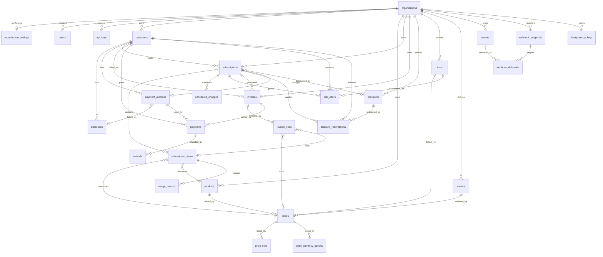

# Bouclay — Database Schema

Processor-agnostic subscription billing engine (Laravel). This is the authoritative data model: every table, field, type, relationship, and enum. It supersedes the Figma "Plan Board". Built on the Stripe/Paddle billing model — Laravel Cashier Paddle only ships four tables (`customers`, `subscriptions`, `subscription_items`, `transactions`) because Paddle is the merchant-of-record and owns the catalog; Bouclay *is* the engine, so it models everything Paddle keeps server-side.

---

## Conventions

These apply to every table — assume them rather than repeating per row.

- **Primary key**: `ulid` column named `id`.
- **Money**: always `bigInteger` in **minor units** (kobo/cents) paired with an ISO-4217 `currency` `char(3)`. Never floats.
- **Tenancy**: every tenant-owned table carries `organization_id` (`ulid`, FK, indexed). All queries scope by it; workers never trust a join to infer the tenant.
- **Flexibility**: `custom_data` `json` (nullable) on the major entities — Paddle's `custom_data` / Stripe's `metadata`. Avoids a polymorphic metadata table.
- **Timestamps**: `created_at` + `updated_at` on every table. `deleted_at` (SoftDeletes) on catalog and customer rows only.
- **Enums**: stored as `string`, cast to PHP enums in the model. Values listed per column and collected in the [Enums appendix](#enums-appendix).
- **Idempotency**: all external write endpoints gate on `idempotency_keys`.

---

## Entity Relationship Diagram

> Note: `organization_id` lives on nearly every table; the diagram only draws the org edges to aggregate roots to stay legible.

---

## 1. Platform & Tenancy

### `organizations`
The tenant / merchant using Bouclay.

| Column | Type | Null | Notes |
|---|---|---|---|
| id | ulid | no | PK |
| name | string | no | |
| slug | string | no | unique |
| default_currency | char(3) | no | |
| custom_data | json | yes | |
| created_at / updated_at | timestamp | no | |

### `organization_settings`
One row per org — the things tenants tweak (invoice numbering, dunning).

| Column | Type | Null | Notes |
|---|---|---|---|
| id | ulid | no | PK |
| organization_id | ulid | no | FK → organizations, unique |
| invoice_prefix | string | no | e.g. `BCL` |
| next_invoice_number | unsignedBigInteger | no | sequence counter, default 1 |
| invoice_template | string | yes | template key |
| invoice_footer | text | yes | |
| billing_timezone | string | no | e.g. `Africa/Lagos`; anchors when "due today" fires |
| tax_behavior | string | no | enum: `inclusive` / `exclusive` — org default |
| dunning_config | json | yes | retry schedule + terminal action override |
| created_at / updated_at | timestamp | no | |

### `users`
Auth for the tenant's staff.

| Column | Type | Null | Notes |
|---|---|---|---|
| id | ulid | no | PK |
| organization_id | ulid | no | FK → organizations |
| name | string | no | |
| email | string | no | unique with organization_id |
| password | string | no | |
| role | string | no | enum: `owner` / `admin` / `member` |
| phone | string | yes | |
| email_verified_at | timestamp | yes | |
| created_at / updated_at / deleted_at | timestamp | yes | SoftDeletes |

### `api_keys`
Per-org API credentials.

| Column | Type | Null | Notes |
|---|---|---|---|
| id | ulid | no | PK |
| organization_id | ulid | no | FK → organizations |
| mode | string | no | enum: `test` / `live` |
| kind | string | no | enum: `publishable` / `secret` |
| hashed_secret | string | no | unique; store a hash, show the raw key once |
| last_four | string | yes | for display |
| revoked_at | timestamp | yes | |
| created_at / updated_at | timestamp | no | |

### `idempotency_keys`
Replay guard for all external writes.

| Column | Type | Null | Notes |
|---|---|---|---|
| id | ulid | no | PK |
| organization_id | ulid | no | FK → organizations |
| key | string | no | unique with organization_id |
| request_hash | string | no | guards against key reuse with a different body |
| response_code | smallInteger | yes | |
| response_body | json | yes | replayed on duplicate |
| locked_at | timestamp | yes | in-flight guard |
| created_at | timestamp | no | |

---

## 2. Customers & Payment Methods

### `customers`
The end-customers being billed.

| Column | Type | Null | Notes |
|---|---|---|---|
| id | ulid | no | PK |
| organization_id | ulid | no | FK → organizations |
| external_ref | string | yes | the tenant's own customer id; unique with organization_id when set |
| name | string | yes | |
| email | string | no | |
| phone | string | yes | |
| currency | char(3) | yes | defaults to org currency |
| locale | string | yes | e.g. `en`, `fr` |
| country | char(2) | yes | ISO-3166 |
| default_payment_method_id | ulid | yes | FK → payment_methods (see migration order — added after payment_methods exists) |
| custom_data | json | yes | |
| created_at / updated_at / deleted_at | timestamp | yes | SoftDeletes |

### `addresses`
A customer's address book. Invoices snapshot the address at finalise time — never rely on this live FK for a historical invoice.

| Column | Type | Null | Notes |
|---|---|---|---|
| id | ulid | no | PK |
| organization_id | ulid | no | FK → organizations |
| customer_id | ulid | no | FK → customers |
| type | string | no | enum: `billing` / `shipping` |
| name | string | yes | |
| line1 | string | no | |
| line2 | string | yes | |
| city | string | yes | |
| region | string | yes | |
| postal_code | string | yes | |
| country | char(2) | no | |
| phone | string | yes | |
| is_default | boolean | no | per type, default false |
| created_at / updated_at | timestamp | no | |

### `payment_methods`
Tokenised payment instruments. Processor-agnostic.

| Column | Type | Null | Notes |
|---|---|---|---|
| id | ulid | no | PK |
| organization_id | ulid | no | FK → organizations |
| customer_id | ulid | no | FK → customers |
| processor | string | no | enum: `nomba` (extensible) |
| processor_token | string | no | tokenised reference |
| type | string | no | enum: `card` / `bank` / `wallet` |
| brand | string | yes | visa / mastercard |
| last4 | string | yes | |
| exp_month | smallInteger | yes | |
| exp_year | smallInteger | yes | |
| fingerprint | string | yes | dedupes the same card across customers |
| issuer | string | yes | |
| billing_address_id | ulid | yes | FK → addresses |
| is_default | boolean | no | default false |
| status | string | no | enum: `active` / `expired` / `revoked` |
| custom_data | json | yes | |
| created_at / updated_at | timestamp | no | |

---

## 3. Catalog & Pricing

Stripe/Paddle model: **Product → Price**. A "plan" is a product whose prices are recurring. A price describes the *shape* of a charge; the money lives on the price for simple models and in `price_tiers` / `price_currency_options` for the complex ones.

### `products`

| Column | Type | Null | Notes |
|---|---|---|---|
| id | ulid | no | PK |
| organization_id | ulid | no | FK → organizations |
| name | string | no | |
| description | text | yes | |
| category | string | yes | keep as string unless you truly need a categories table |
| image_url | string | yes | |
| status | string | no | enum: `active` / `archived` |
| custom_data | json | yes | |
| created_at / updated_at / deleted_at | timestamp | yes | SoftDeletes |

### `prices`

| Column | Type | Null | Notes |
|---|---|---|---|
| id | ulid | no | PK |
| organization_id | ulid | no | FK → organizations |
| product_id | ulid | no | FK → products |
| name | string | yes | e.g. "Standard monthly" |
| type | string | no | enum: `recurring` / `one_time` |
| pricing_model | string | no | enum: `standard` / `tiered` / `volume` / `graduated` / `package` |
| usage_type | string | no | enum: `licensed` / `metered`; default `licensed` |
| unit_amount | bigInteger | yes | minor units; used for `standard` + `package`; null for tiered/volume/graduated |
| currency | char(3) | no | simple multi-currency = one price row per currency |
| billing_interval | string | yes | enum: `day` / `week` / `month` / `year`; null for `one_time` |
| billing_frequency | smallInteger | no | default 1; `3` + `month` = every 3 months |
| package_size | integer | yes | for `package`; units per block |
| meter_id | ulid | yes | FK → meters; required when `usage_type = metered` |
| tax_mode | string | no | enum: `inclusive` / `exclusive` / `account`; default `account` |
| default_trial_id | ulid | yes | FK → trials; the trial this price offers by default |
| status | string | no | enum: `active` / `archived` |
| version | integer | no | default 1; bump to grandfather existing subscribers |
| custom_data | json | yes | |
| created_at / updated_at | timestamp | no | |

### `price_tiers`
Rows that drive tiered / volume / graduated pricing. **One table, three behaviours** — only the application differs.

| Column | Type | Null | Notes |
|---|---|---|---|
| id | ulid | no | PK |
| price_id | ulid | no | FK → prices |
| tier_index | smallInteger | no | 0-based order |
| up_to | bigInteger | yes | null = final "infinity" tier |
| unit_amount | bigInteger | no | minor units, per unit in this tier |
| flat_amount | bigInteger | yes | minor units, flat fee for landing in this tier |

Application at billing time:
- **volume** — the whole quantity is priced at the single tier its total lands in.
- **graduated** — units are priced progressively across every tier they span, then summed.
- **package** — ignores this table: `ceil(quantity / package_size) × unit_amount` off the price row.
- **standard** — `quantity × unit_amount`, no tiers.

### `price_currency_options` *(optional — defer for MVP)*
Present one logical price in many currencies instead of a row per currency. If used, add `currency` to `price_tiers` too.

| Column | Type | Null | Notes |
|---|---|---|---|
| id | ulid | no | PK |
| price_id | ulid | no | FK → prices |
| currency | char(3) | no | unique with price_id |
| unit_amount | bigInteger | no | minor units |

### `meters` *(only with metered billing)*
Defines a usage meter.

| Column | Type | Null | Notes |
|---|---|---|---|
| id | ulid | no | PK |
| organization_id | ulid | no | FK → organizations |
| name | string | no | |
| event_name | string | no | what tenants report against |
| aggregation | string | no | enum: `sum` / `last_during_period` / `max` |
| created_at / updated_at | timestamp | no | |

---

## 4. Subscriptions

### `subscriptions`

| Column | Type | Null | Notes |
|---|---|---|---|
| id | ulid | no | PK |
| organization_id | ulid | no | FK → organizations (denormalised) |
| customer_id | ulid | no | FK → customers |
| type | string | no | named slot, default `default`; lets one customer hold multiple distinct subs |
| status | string | no | enum: `incomplete` / `incomplete_expired` / `trialing` / `active` / `past_due` / `paused` / `canceled` |
| currency | char(3) | no | fixed for the life of the sub |
| collection_mode | string | no | enum: `automatic` / `manual` |
| payment_method_id | ulid | yes | FK → payment_methods |
| discount_id | ulid | yes | FK → discounts |
| billing_anchor | string | yes | e.g. month-end anchor metadata |
| current_period_start | timestamp | yes | |
| current_period_end | timestamp | yes | next renewal charge fires here |
| trial_ends_at | timestamp | yes | the clock the workers read |
| paused_at | timestamp | yes | |
| pause_resumes_at | timestamp | yes | |
| canceled_at | timestamp | yes | set when cancellation is scheduled |
| ends_at | timestamp | yes | grace-period end; `subscribed` stays true until now() passes this |
| custom_data | json | yes | |
| created_at / updated_at | timestamp | no | |

### `subscription_items`
A subscription carries many priced items (base + add-ons + metered).

| Column | Type | Null | Notes |
|---|---|---|---|
| id | ulid | no | PK |
| subscription_id | ulid | no | FK → subscriptions |
| price_id | ulid | no | FK → prices |
| product_id | ulid | no | FK → products (denormalised) |
| quantity | integer | no | default 1; for licensed prices |
| status | string | no | enum: `active` / `removed` |
| metered | boolean | no | mirrors the price's usage_type, default false |
| created_at / updated_at | timestamp | no | |

### `usage_records` *(only with metered billing)*
Reported usage drained into invoice lines at period end.

| Column | Type | Null | Notes |
|---|---|---|---|
| id | ulid | no | PK |
| subscription_item_id | ulid | no | FK → subscription_items |
| quantity | bigInteger | no | |
| idempotency_key | string | no | unique with subscription_item_id |
| recorded_at | timestamp | no | |
| created_at | timestamp | no | |

### `scheduled_changes`
Future cancel / pause / resume at the next boundary (the Paddle "borrow" pattern).

| Column | Type | Null | Notes |
|---|---|---|---|
| id | ulid | no | PK |
| subscription_id | ulid | no | FK → subscriptions |
| action | string | no | enum: `cancel` / `pause` / `resume` |
| effective_at | timestamp | no | |
| payload | json | yes | |
| applied_at | timestamp | yes | worker marks done (audit trail) |
| created_at / updated_at | timestamp | no | |

---

## 5. Trials

A trial gates access and **delays the first charge** — distinct from a discount. Two models, mirroring `discounts` → `discount_redemptions`: a reusable definition, and the applied instance on a subscription. `subscriptions.trial_ends_at` stays as the denormalised clock the billing/access workers read.

### `trials` (definition)

| Column | Type | Null | Notes |
|---|---|---|---|
| id | ulid | no | PK |
| organization_id | ulid | no | FK → organizations |
| name | string | no | e.g. "14-day free trial" |
| type | string | no | enum: `free` / `card_required` / `paid` |
| length_count | integer | no | e.g. 14 |
| length_interval | string | no | enum: `day` / `week` / `month`; default `day` |
| trial_amount | bigInteger | yes | minor units, for `paid` trials |
| trial_currency | char(3) | yes | required for `paid` |
| auto_convert | boolean | no | default true; roll into full price at end |
| once_per_customer | boolean | no | default true; anti-abuse, enforced via `trial_offers` |
| active | boolean | no | default true |
| custom_data | json | yes | |
| created_at / updated_at | timestamp | no | |

### `trial_offers` (applied trial)
The concrete trial extended to one subscription. Snapshots the definition so later edits to a `trials` row don't rewrite history.

| Column | Type | Null | Notes |
|---|---|---|---|
| id | ulid | no | PK |
| organization_id | ulid | no | FK → organizations |
| subscription_id | ulid | no | FK → subscriptions |
| trial_id | ulid | yes | FK → trials (null = ad-hoc inline trial) |
| customer_id | ulid | no | FK → customers (denormalised; enforces once_per_customer) |
| type | string | no | snapshot of trial type at application |
| starts_at | timestamp | no | |
| ends_at | timestamp | no | `subscriptions.trial_ends_at` mirrors this |
| trial_amount | bigInteger | yes | snapshot, minor units |
| trial_currency | char(3) | yes | |
| status | string | no | enum: `active` / `converted` / `canceled` / `expired` |
| converted_at | timestamp | yes | when it rolled into the first paid period |
| created_at / updated_at | timestamp | no | |

**State-machine threading**: `free` (no card) → sub starts in `trialing`, skips `incomplete`. `card_required` / `paid` → card captured (and intro amount charged for `paid`) at signup, so `incomplete → trialing` is real and `incomplete_expired` applies if setup never completes. At `ends_at` with `auto_convert` → first full charge (→ `active`), offer → `converted`; abandoned → `expired`.

---

## 6. Discounts

### `discounts`

| Column | Type | Null | Notes |
|---|---|---|---|
| id | ulid | no | PK |
| organization_id | ulid | no | FK → organizations |
| code | string | yes | unique with organization_id when set |
| type | string | no | enum: `percentage` / `flat` |
| amount | bigInteger | yes | minor units (flat); null for percentage |
| percentage | decimal(5,2) | yes | null for flat |
| currency | char(3) | yes | required for flat |
| duration | string | no | enum: `once` / `repeating` / `forever` |
| duration_in_intervals | integer | yes | for `repeating` |
| max_redemptions | integer | yes | |
| times_redeemed | integer | no | default 0 |
| applies_to | json | yes | product/price id allow-list; null = everything |
| starts_at | timestamp | yes | |
| expires_at | timestamp | yes | |
| active | boolean | no | default true |
| created_at / updated_at | timestamp | no | |

### `discount_redemptions`

| Column | Type | Null | Notes |
|---|---|---|---|
| id | ulid | no | PK |
| discount_id | ulid | no | FK → discounts |
| subscription_id | ulid | no | FK → subscriptions |
| customer_id | ulid | no | FK → customers |
| applied_at | timestamp | no | |

---

## 7. Billing: Invoices, Lines, Payments

### `invoices`
A frozen legal document — numbered, with a full money breakdown and snapshots taken at finalise time.

| Column | Type | Null | Notes |
|---|---|---|---|
| id | ulid | no | PK |
| organization_id | ulid | no | FK → organizations |
| customer_id | ulid | no | FK → customers |
| subscription_id | ulid | yes | FK → subscriptions (null for one-off) |
| number | string | yes | `{prefix}-{sequence}`, assigned at finalise; unique with organization_id |
| status | string | no | enum: `draft` / `open` / `paid` / `void` / `uncollectible` |
| billing_reason | string | no | enum: `subscription_create` / `subscription_cycle` / `subscription_update` / `manual` |
| collection_mode | string | no | enum: `automatic` / `manual` |
| currency | char(3) | no | |
| subtotal | bigInteger | no | minor units, before tax/discount |
| discount_total | bigInteger | no | minor units, default 0 |
| tax_total | bigInteger | no | minor units, default 0 |
| total | bigInteger | no | minor units |
| amount_paid | bigInteger | no | minor units, default 0 |
| amount_due | bigInteger | no | = total − amount_paid |
| billing_address | json | yes | snapshot |
| customer_snapshot | json | yes | name/email at issue time |
| period_start | timestamp | yes | |
| period_end | timestamp | yes | |
| due_at | timestamp | yes | |
| finalized_at | timestamp | yes | |
| paid_at | timestamp | yes | |
| voided_at | timestamp | yes | |
| custom_data | json | yes | |
| created_at / updated_at | timestamp | no | |

### `invoice_lines`

| Column | Type | Null | Notes |
|---|---|---|---|
| id | ulid | no | PK |
| invoice_id | ulid | no | FK → invoices |
| subscription_item_id | ulid | yes | FK → subscription_items |
| price_id | ulid | yes | FK → prices |
| product_id | ulid | yes | FK → products |
| kind | string | no | enum: `subscription` / `proration` / `usage` / `one_time` / `tax` / `discount` |
| description | string | no | |
| quantity | integer | no | default 1 |
| unit_amount | bigInteger | no | minor units |
| subtotal | bigInteger | no | minor units |
| discount_amount | bigInteger | no | minor units, default 0 |
| tax_amount | bigInteger | no | minor units, default 0 |
| total | bigInteger | no | minor units |
| period_start | timestamp | yes | window this line covers (drives proration) |
| period_end | timestamp | yes | |
| proration | boolean | no | default false |
| created_at / updated_at | timestamp | no | |

### `payments`
One charge attempt against the processor (merges the board's `payment_attempts` with the handwritten "Transaction").

| Column | Type | Null | Notes |
|---|---|---|---|
| id | ulid | no | PK |
| organization_id | ulid | no | FK → organizations |
| invoice_id | ulid | no | FK → invoices |
| customer_id | ulid | no | FK → customers |
| payment_method_id | ulid | yes | FK → payment_methods |
| processor | string | no | enum: `nomba` |
| processor_reference | string | yes | the Nomba transaction ref |
| amount | bigInteger | no | minor units |
| currency | char(3) | no | |
| status | string | no | enum: `pending` / `processing` / `succeeded` / `failed` / `refunded` |
| risk_level | string | yes | |
| failure_code | string | yes | drives dunning classification (hard vs soft decline) |
| failure_reason | string | yes | |
| attempt_number | integer | no | default 1 |
| idempotency_key | string | no | unique; one charge per (invoice, attempt) |
| raw_response | json | yes | full Nomba callback payload |
| processed_at | timestamp | yes | |
| created_at / updated_at | timestamp | no | |

### `refunds` *(optional — cut for MVP)*

| Column | Type | Null | Notes |
|---|---|---|---|
| id | ulid | no | PK |
| payment_id | ulid | no | FK → payments |
| amount | bigInteger | no | minor units |
| currency | char(3) | no | |
| reason | string | yes | |
| status | string | no | enum: `pending` / `succeeded` / `failed` |
| processor_reference | string | yes | |
| created_at / updated_at | timestamp | no | |

---

## 8. Events & Webhooks

### `events`
Emitted-event log (`subscription.created`, `invoice.paid`, …).

| Column | Type | Null | Notes |
|---|---|---|---|
| id | ulid | no | PK |
| organization_id | ulid | no | FK → organizations |
| type | string | no | |
| data | json | no | |
| created_at | timestamp | no | |

### `webhook_endpoints`

| Column | Type | Null | Notes |
|---|---|---|---|
| id | ulid | no | PK |
| organization_id | ulid | no | FK → organizations |
| url | string | no | |
| signing_secret | string | no | HMAC secret |
| active | boolean | no | default true |
| created_at / updated_at | timestamp | no | |

### `webhook_deliveries`
At-least-once delivery with exponential backoff.

| Column | Type | Null | Notes |
|---|---|---|---|
| id | ulid | no | PK |
| webhook_endpoint_id | ulid | no | FK → webhook_endpoints |
| event_id | ulid | no | FK → events |
| status | string | no | enum: `pending` / `succeeded` / `failed` |
| attempts | integer | no | default 0 |
| next_attempt_at | timestamp | yes | backoff schedule |
| created_at / updated_at | timestamp | no | |

---

## Eloquent relationship map

| Model | Relationships |
|---|---|
| Organization | hasOne settings; hasMany users, apiKeys, customers, products, prices, subscriptions, invoices, discounts, trials, meters, events, webhookEndpoints |
| User | belongsTo organization |
| Customer | belongsTo organization; hasMany addresses, paymentMethods, subscriptions, invoices, payments, trialOffers; belongsTo defaultPaymentMethod |
| Address | belongsTo organization, customer |
| PaymentMethod | belongsTo organization, customer, billingAddress; hasMany payments |
| Product | belongsTo organization; hasMany prices |
| Price | belongsTo organization, product, meter, defaultTrial; hasMany tiers, currencyOptions, subscriptionItems |
| PriceTier | belongsTo price |
| Meter | belongsTo organization; hasMany prices, usageRecords (through items) |
| Subscription | belongsTo organization, customer, paymentMethod, discount; hasMany items, scheduledChanges, trialOffers, invoices |
| SubscriptionItem | belongsTo subscription, price, product; hasMany usageRecords |
| UsageRecord | belongsTo subscriptionItem |
| ScheduledChange | belongsTo subscription |
| Trial | belongsTo organization; hasMany trialOffers, prices (as default) |
| TrialOffer | belongsTo organization, subscription, trial, customer |
| Discount | belongsTo organization; hasMany redemptions |
| DiscountRedemption | belongsTo discount, subscription, customer |
| Invoice | belongsTo organization, customer, subscription; hasMany lines, payments |
| InvoiceLine | belongsTo invoice, subscriptionItem, price, product |
| Payment | belongsTo organization, invoice, customer, paymentMethod; hasMany refunds |
| Refund | belongsTo payment |
| Event | belongsTo organization; hasMany deliveries |
| WebhookEndpoint | belongsTo organization; hasMany deliveries |
| WebhookDelivery | belongsTo webhookEndpoint, event |

---

## Enums appendix

| Column | Values |
|---|---|
| users.role | owner, admin, member |
| api_keys.mode | test, live |
| api_keys.kind | publishable, secret |
| organization_settings.tax_behavior | inclusive, exclusive |
| addresses.type | billing, shipping |
| payment_methods.processor | nomba |
| payment_methods.type | card, bank, wallet |
| payment_methods.status | active, expired, revoked |
| products.status | active, archived |
| prices.type | recurring, one_time |
| prices.pricing_model | standard, tiered, volume, graduated, package |
| prices.usage_type | licensed, metered |
| prices.billing_interval | day, week, month, year |
| prices.tax_mode | inclusive, exclusive, account |
| prices.status | active, archived |
| meters.aggregation | sum, last_during_period, max |
| subscriptions.status | incomplete, incomplete_expired, trialing, active, past_due, paused, canceled |
| subscriptions.collection_mode | automatic, manual |
| subscription_items.status | active, removed |
| scheduled_changes.action | cancel, pause, resume |
| trials.type | free, card_required, paid |
| trials.length_interval | day, week, month |
| trial_offers.status | active, converted, canceled, expired |
| discounts.type | percentage, flat |
| discounts.duration | once, repeating, forever |
| invoices.status | draft, open, paid, void, uncollectible |
| invoices.billing_reason | subscription_create, subscription_cycle, subscription_update, manual |
| invoices.collection_mode | automatic, manual |
| invoice_lines.kind | subscription, proration, usage, one_time, tax, discount |
| payments.processor | nomba |
| payments.status | pending, processing, succeeded, failed, refunded |
| refunds.status | pending, succeeded, failed |
| webhook_deliveries.status | pending, succeeded, failed |

---

## Indexing & constraints

- **FK indexes**: index every FK column.
- **Tenancy**: index `organization_id` on every table; add composite `(organization_id, status)` on `subscriptions`, `invoices`, `payments` for dashboard filters.
- **Billing scheduler hot path**: composite index on `subscriptions (status, current_period_end)` — the scheduler scans for due subs by this.
- **Unique**: `organizations.slug`; `users (organization_id, email)`; `api_keys.hashed_secret`; `customers (organization_id, external_ref)` (when not null); `idempotency_keys (organization_id, key)`; `invoices (organization_id, number)`; `payments.idempotency_key`; `usage_records (subscription_item_id, idempotency_key)`; `price_currency_options (price_id, currency)`.
- **Anti-abuse**: index `trial_offers (customer_id, trial_id)` and `discount_redemptions (discount_id, customer_id)`.
- **Money**: enforce non-negative amounts at the application layer; keep everything in the subscription's single currency (don't mix currencies on one invoice).

---

## Migration order (FK-safe)

Two FKs are circular and must be deferred: `customers.default_payment_method_id ↔ payment_methods.customer_id`, and `payment_methods.billing_address_id ↔ addresses.customer_id`. Create the base tables first, then add the back-reference in a follow-up migration.

1. organizations
2. organization_settings, users, api_keys, idempotency_keys, events, webhook_endpoints
3. webhook_deliveries
4. customers *(without `default_payment_method_id`)*
5. addresses
6. payment_methods
7. **alter** customers → add `default_payment_method_id` FK
8. products, meters, trials
9. prices *(refs products, meters, trials)*
10. price_tiers, price_currency_options
11. discounts
12. subscriptions *(refs customers, payment_methods, discounts)*
13. subscription_items, scheduled_changes, trial_offers, discount_redemptions
14. usage_records
15. invoices
16. invoice_lines
17. payments
18. refunds

---

## Build order & cut-lines (hackathon)

**Build now** — a complete, demoable engine: organizations, users, api_keys, customers, payment_methods, products, prices (standard + one tiered model), price_tiers, subscriptions, subscription_items, trials + trial_offers (free trial only), invoices, invoice_lines, payments, the lifecycle + dunning workers, events, webhook_endpoints, webhook_deliveries, idempotency_keys.

**Defer** — keep the tables, don't wire the logic: meters + usage_records (metered billing), price_currency_options, refunds, both graduated *and* volume (ship one), discounts + discount_redemptions if time-pressed, and the `paid` / `card_required` trial types (ship `free` — it's table-stakes).

---

## Cashier / Paddle mapping (positioning)

- Bouclay's `products` / `prices` / `subscriptions` / `subscription_items` correspond to Paddle's catalog and Cashier's mirror — except Bouclay *owns* them rather than mirroring Paddle.
- Bouclay's `payments` is what Cashier calls `transactions`, but Bouclay records every *attempt* (it runs its own dunning), where Cashier stores only Paddle's completed transactions.
- The `incomplete` / `incomplete_expired` states and the first-class dunning machine are the deliberate divergence from Paddle: Bouclay charges the token itself, so it needs the pre-active states Paddle hides behind hosted checkout.
